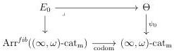

CHAPTER 5. THE \((\infty,1)\)-CATEGORY OF MARKED \((\infty,\omega)\)-CATEGORIES

5.2.5.7. Let E and F be two objects of  \( \underline{\mathrm{LCart}}^{c}(I) \) , and a a globular sum. Remark that a morphism  \( [a,1]\to\underline{\mathrm{LCart}}^{c}(I) \)  corresponds to a morphism  \( E\times id_{a}\to F\times id_{a} \) , and so to a morphism  \( X\times a\to Y \)  over I where X and Y are respectively the domain of E and F. We then have an equivalence:

\[
\hom_ {\underline {{\mathrm{LCart}}} (I)} (E, F) \sim \operatorname{Map} _ {I} (E, F). \tag {5.2.5.8}
\]

This then implies that  \( \mathrm{LCart}^{c}(I) \)  is locally V-small.

5.2.5.9. Let  \( i: I \to J \)  be a morphism between marked  \( (\infty, \omega) \) -category, a a globular sum, and p a classified left cartesian fibration over  \( a^{\flat} \times J \) . Remark that we have a canonical equivalence

\[
\mathbf {R} (i \times i d _ {a ^ {\flat}}) ^ {*} (p \times i d _ {a ^ {\flat}}) \sim (\mathbf {R} i ^ {*} p) \times i d _ {a ^ {\flat}}
\]

natural in \(a:\Theta^{op}\). The functor \(\mathbf{R}(i\times id_{a^{\flat}})^*\) then restricts to a functor

\[
(i _ {a}) ^ {*}: \mathrm{LCart} ^ {c} (J; a) \to \mathrm{LCart} ^ {c} (I; a)
\]

natural in  \( a : \Theta^{op} \) , and then to a morphism of  \( (\infty, \omega) \) -categories:

\[
i ^ {*}: \underline {{\mathrm{LCart}}} ^ {c} (J) \rightarrow \underline {{\mathrm{LCart}}} ^ {c} (I) \tag {5.2.5.10}
\]

5.2.5.11. Let  \( i: I \to A^{\sharp} \)  be a morphism between marked  \( (\infty, \omega) \) -categories. We are now willing to construct a morphism  \( i_{!}: \underline{\mathrm{LCart}}^{c}(I) \to \underline{\mathrm{LCart}}(A^{\sharp}) \)  which corresponds to  \( \mathbf{L}i_{!}: \mathrm{LCart}^{c}(I) \to \mathrm{LCart}(A^{\sharp}) \)  on the maximal sub  \( (\infty, 1) \) -category.

We denote by  \( E_{0} \)  and  \( E_{1} \)  the  \( (\infty,1) \) -categories fitting in the cartesian square:

where  \( \operatorname{Arr}^{fib}((\infty,\omega)\text{-cat}_{\mathrm{m}}) \)  is the full sub  \( (\infty,1) \) -category of  \( \operatorname{Arr}((\infty,\omega)\text{-cat}_{\mathrm{m}}) \)  whose objects are classified left cartesian fibrations, and where  \( \psi_{0} \)  and  \( \psi_{1} \)  send respectively a on  \( I\times a^{\flat} \)  and  \( A^{\sharp}\times a^{\flat} \) . The morphism i induces an adjunction

\[
i _ {!}: E _ {0} \xrightarrow [ \leftarrow ]{\perp} E _ {1}: i ^ {*} \tag {5.2.5.12}
\]

where the left adjoint sends a left cartesian fibration p over  \( I \times a^{\flat} \)  to  \( \mathbf{L}(i \times id_{a})_{!}p \)  and the right adjoint sends a left cartesian fibration q over  \( A^{\sharp} \times a^{\flat} \)  to  \( \mathbf{R}(i \times id_{a})^{*}q \) .

294