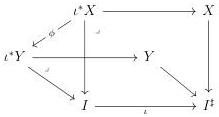

CHAPTER 6. THE \((\infty, \omega)\)-CATEGORY OF SMALL \((\infty, \omega)\)-CATEGORIES

\((\infty ,\omega)\) -category. There is an equivalence

\[
\int_ {A}: \mathrm{Hom} (A, \underline {{\omega}}) \to \tau_ {0} \mathrm{LCart} (A ^ {\sharp}).
\]

where \(\tau_0\mathrm{LCart}(A^\sharp)\) is the \(\infty\)-groupoid of left cartesian fibrations over \(A^\sharp\) with small fibers.

Given a functor \( f: A \to \underline{\omega} \), the left cartesian fibration \( \int_A f \) is a colimit (computed in \( (\infty, \omega) \)-cat\(_{\mathrm{m}/A^{\sharp}}\)) of a simplicial object whose value on \( n \) is of shape

\[
\coprod_ {x _ {0}, \dots , x _ {n}: A _ {0}} X (x _ {0}) ^ {\flat} \times \hom_ {A} (x _ {0}, \dots , x _ {n}) ^ {\flat} \times A _ {x _ {n /}} ^ {\sharp} \to A ^ {\sharp}
\]

This formula is similar to the one given in [GHN] for \((\infty, 1)\)-categories, and to the one given in [War11] for strict \(\omega\)-categories.

We also prove a univalence result:

Corollary 6.1.3.31. Let \( I \) be a marked \( (\infty, \omega) \)-category. We denote by \( I^{\sharp} \) the marked \( (\infty, \omega) \)-category obtained from \( I \) by marking all cells and \( \iota : I \to I^{\sharp} \) the induced morphism. There is a natural correspondence between

(1) functors \(f:I\otimes [1]^{\sharp}\to \underline{\omega}^{\sharp},\)
(2) pairs of small left cartesian fibration \(X \to I^{\sharp}\), \(Y \to I^{\sharp}\) together with diagrams

Recall that if \( I \) is of shape \( B^{\sharp} \), then the underlying \( (\infty, \omega) \)-category of \( B^{\sharp} \otimes [1]^{\sharp} \) is \( B \times [1] \), and if \( I \) is of shape \( B^{\flat} \), the underlying \( (\infty, \omega) \)-category of \( B^{\flat} \otimes [1]^{\sharp} \) is \( B \otimes [1] \). On the other hand, if \( I \) is \( B^{\sharp} \), \( \iota \) is the identity, and \( \phi \) then preserves all cartesian liftings, and if \( I \) is \( B^{\flat} \), \( \phi \) doesn't need to preserve cartesian liftings.

By varying the marking, we can continuously move from the cartesian product with the interval to the Gray product with the interval on one side, and on the other side, we can continuously move from morphisms between left cartesian fibrations that preserve the marking to the ones that do not preserve it a priori.

Eventually, we also get an \((\infty, \omega)\)-functorial Grothendieck construction, expressed by the following corollary:

300