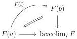
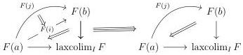

**Corollary 6.1.4.3.** *Let $A$ be a $\mathbf{U}$-small $(\infty, \omega)$-category. Let $\underline{\mathrm{LCart}}(A^{\sharp})$ be the $(\infty, \omega)$-category of small left cartesian fibrations over $A^{\sharp}$. There is an equivalence*

$$\underline{\mathrm{Hom}}(A, \underline{\omega}) \sim \underline{\mathrm{LCart}}(A^{\sharp})$$

*natural in $A$.*

In the second section of this chapter, for a locally small $(\infty, \omega)$-category $C$, we construct the Yoneda embedding, which is a functor $y : C \to \widehat{C}$ where $\widehat{C} := \underline{\mathrm{Hom}}(C^t, \underline{\omega})$. We prove the Yoneda lemma:

**Theorem 6.2.1.16.** *The Yoneda embedding is fully faithful.*

**Theorem 6.2.1.18.** *Let $C$ be an $(\infty, \omega)$-category. There is an equivalence between the functor*

$$\mathrm{hom}_{\widehat{C}}(y_\_, \_) : C^t \times \widehat{C} \to \underline{\omega}$$

*and the functor*

$$ev : C^t \times \widehat{C} \to \underline{\omega}.$$

In the last three sections, we use these results to study and demonstrate the basic properties of adjunctions, lax (co)limits, and left Kan extensions.

We begin by studying adjunctions, and we establish the following expected result.

**Theorem 6.2.2.9.** *Let $u : C \to D$ and $v : D \to C$ be two functors between locally $\mathbf{U}$-small $(\infty, \omega)$-categories. The two following are equivalent.*

(1) The pair $(u, v)$ admits an adjoint structure.
(2) Their exists a pair of natural transformations $\mu : id_C \to vu$ and $\epsilon : uv \to id_D$ together with equivalences $(\epsilon \circ_0 u) \circ_1 (u \circ_0 \mu) \sim id_u$ and $(v \circ_0 \epsilon) \circ_1 (\mu \circ_0 v) \sim id_v$.

In the next subsection, given a morphism $f : I \to C^{\sharp}$ between marked $(\infty, \omega)$-categories, we define the notion of lax colimit and lax limit for the functor $f$. If $f$ admits such a lax colimit, for any 1-cell $i : a \to b$ in $I$, we have a triangle

If $i$ is marked, the preceding 2-cell is an equivalence. For any 2-cell $u : i \to j$, we have a diagram

301