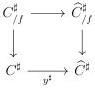

CHAPTER 6. THE $(\infty, \omega)$-CATEGORY OF SMALL $(\infty, \omega)$-CATEGORIES

If $u$ is marked, the 3-cell is an equivalence. We can continue these diagrams in higher dimensions and we have similar assertions for lax limits. The marking therefore allows us to play on the "lax character" of the universal property that the lax colimit must verify.

After providing several characterizations of lax colimits and limits, we prove the following result:

**Theorem 6.2.3.24.** *Let $C$ be a $\mathbf{U}$-small $(\infty, \omega)$-category. Let $f$ be an object of $\widehat{C}$. We define $C_{/f}^{\sharp}$ as the following pullback*

*The colimit of the functor $\pi : C_{/f}^{\sharp} \to C^{\sharp} \xrightarrow{y^{\sharp}} \widehat{C}^{\sharp}$ is $f$.*

We conclude this chapter by studying Kan extensions.

**Cardinality hypothesis.** We fix during this chapter three Grothendieck universes $\mathbf{U} \in \mathbf{V} \in \mathbf{W}$, such that $\omega \in \mathbf{U}$. All defined notions depend on a choice of cardinality. When nothing is specified, this corresponds to the implicit choice of the cardinality $\mathbf{V}$. We denote by Set the $\mathbf{W}$-small 1-category of $\mathbf{V}$-small sets, $\infty$-grd the $\mathbf{W}$-small $(\infty, 1)$-category of $\mathbf{V}$-small $\infty$-groupoids and $(\infty, 1)$-cat the $\mathbf{W}$-small $(\infty, 1)$-category of $\mathbf{V}$-small $(\infty, 1)$-categories.

## 6.1 Univalence

### 6.1.1 Internal category

**6.1.1.1.** For $X$ an object of $\mathrm{Psh}^{\infty}(\Theta)$ and $K$ a simplicial $\infty$-groupoid, we define the simplicial object $\langle X, K \rangle$ of $(\infty, \omega)$-cat whose value on $n$ is given by

$$\langle X, K \rangle_n := X \times K_n$$

If $K$ is the representable $[n]$, this object is simply denoted by $\langle X, n \rangle$. We also define the following set of morphism of $\mathrm{Psh}^{\infty}(\Delta \times \Theta)$:

$$\mathrm{T} := \{\langle a, f \rangle, \ a \in \Theta, f \in \mathrm{W}_1\} \cup \{\langle g, n \rangle, \ g \in \mathrm{W}, [n] \in \Delta\}$$

302