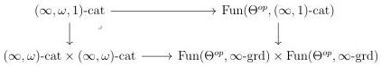
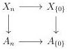

6.1. UNIVALENCE

6.1.1.2. A  \( (\infty,\omega,1) \) -category is a T-local  \( \infty \) -presheaf  \( C\in\mathrm{Psh}^{\infty}(\Theta\times\Delta) \) . We then naturally define

\[
(\infty , \omega , 1) \text {-cat} := \mathrm{Psh} ^ {\infty} (\Theta \times \Delta) _ {\mathrm{T}}.
\]

Unfolding the definition, an  \( (\infty,\omega,1) \) -category is a simplicial object  \( C:\Delta^{op}\to(\infty,\omega) \) -cat such that the induced morphisms

\[
C _ {0} \to \lim _ {[ k ] \to E ^ {e q}} C _ {k} \quad \text { and } \quad C _ {n} \to C _ {1} \times_ {C _ {0}} \times \ldots \times_ {C _ {0}} C _ {1} n \in \mathbb {N}
\]

are equivalences. Remark that we have a cartesian square

where the lower horizontal morphism is induced by the canonical inclusion of  \( (\infty,\omega) \) -category onto  \( \infty \) -presheaves on  \( \Theta \) , and the right vertical one is induced by the functor that maps an  \( (\infty,1) \) -category to the pair consisting of the  \( \infty \) -groupoid of objects and the  \( \infty \) -groupoid of arrows.

6.1.1.3. A morphism  \( p: X \to A \)  between two  \( \infty \) -presheaves on  \( \Theta \times \Delta \)  is a left fibration if it has the unique right lifting property against the set of morphism

\[
\mathrm{J} := \{\langle a, \{0 \} \rangle \rightarrow \langle a, n \rangle , a \in \Theta , [ n ] \in \Delta \} \cup \{\langle g, 0 \rangle , g \in \mathrm{W} \}
\]

Unfolding the notation, this is equivalent to asking that  \( X_{0} \rightarrow A_{0} \)  is W-local, and that the natural square

is cartesian.

Proposition 6.1.1.4. We have an inclusion \( T \subset \widehat{J} \).

Proof. Let \(a\) be an object of \(\Theta\). The \(\infty\)-groupoid of morphisms \(i\) of \(\mathrm{Psh}^{\infty}(\Delta)\) such that \(\langle a, i \rangle\) is in \(\widehat{J}\) contains by definition \(\{0\} \to [n]\), and is closed by colimits and left cancelation. This \(\infty\)-groupoid then contains all initial morphism between \(\infty\)-presheaves on \(\Delta\). As morphisms of \(\mathrm{W}_1\) are initial, \(\widehat{J}\) includes morphisms of shape \(\langle a, f \rangle\) for \(a \in \Theta\) and \(f \in \mathrm{W}_1\).

303