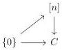

CHAPTER 6. THE \((\infty, \omega)\)-CATEGORY OF SMALL \((\infty, \omega)\)-CATEGORIES

Let \( g: a \to b \) be a morphism of W and n an integer. We have a commutative square

\[
\begin{array}{c} \langle a, \{0 \} \rangle \longrightarrow \langle a, n \rangle \\ \langle g, \{0 \} \rangle \Big \downarrow \qquad \qquad \qquad \qquad \Big \downarrow \langle g, n \rangle \\ \langle b, \{0 \} \rangle \longrightarrow \langle b, n \rangle \end{array}
\]

The two horizontal morphisms are in \(\widehat{J}\). By left cancellation, this implies that \(\langle g, n \rangle\) is in \(\widehat{J}\) which concludes the proof.

If  \( X \to A \)  is a left fibration, with A a  \( (\infty, \omega, 1) \) -category, the last proposition implies that X is also a  \( (\infty, \omega, 1) \) -category. We denote by  \( \operatorname{LFib}(A) \)  the full sub  \( (\infty, 1) \) -category of  \( (\infty, \omega, 1) \) -cat/A whose objects are left fibrations.

Proposition 6.1.1.5. There is a canonical equivalence:

\[
\operatorname{LFib} (\langle a, C \rangle) \sim \operatorname{Fun} (C, (\infty , \omega) \text {-cat} _ {/ a})
\]

natural in \(a:\Theta^{op}\) and \(C:(\infty ,1)\)-cat\(^{op}\).

Proof. Let \( a \) be an object of \( \Theta^{op} \) and \( C \) an \( (\infty, 1) \)-category. We have a canonical equivalence

\[
\mathrm{Psh} ^ {\infty} (\Theta \times \Delta) _ {/ \langle a, C \rangle} \sim \mathrm{Psh} ^ {\infty} (\Theta_ {/ a} \times \Delta_ {/ C}) \sim \mathrm{Fun} (\Theta_ {/ a} ^ {o p}, \mathrm{Psh} ^ {\infty} (\Delta) _ {/ C})
\]

The previous equivalence induces an equivalence

\[
(\mathrm{Psh} ^ {\infty} (\Theta \times \Delta) _ {/ \langle a, C \rangle}) _ {\{\langle b, \{0 \} \rangle \to \langle b, [ n ] \rangle \} / \langle a, C \rangle} \sim \mathrm{Fun} (\Theta_ {/ a} ^ {o p}, (\mathrm{Psh} ^ {\infty} (\Delta) _ {/ C}) _ {\mathrm{I} _ {/ C} ^ {0}})
\]

where \(\mathrm{I}_{/C}^{0}\) corresponds to the \(\infty\)-groupoid of morphisms of \(\mathrm{Psh}^{\infty}(\Delta)_{/C}\) of shape

for n any integer. The  \( (\infty,1) \) -category  \( (\mathrm{Psh}^{\infty}(\Delta)_{/C})_{\mathrm{I}_{/C}^{0}} \)  is equivalent to the  \( (\infty,1) \) -category of Grothendieck V-small opfibrations fibered in  \( \infty \) -groupoid over C, which is itself equivalent to  \( \operatorname{Fun}(C,\infty\text{-grd}) \)  according to the Grothendieck construction. We then have an equivalence

\[
\left(\mathrm{Psh} ^ {\infty} (\Theta \times \Delta) _ {/ \langle a, C \rangle}\right) _ {\{\langle b, \{0 \} \rangle \rightarrow \langle b, [ n ] \rangle \} / \langle a, C \rangle} \sim \operatorname{Fun} \left(\Theta_ {/ a} ^ {o p}, \operatorname{Fun} (C, \infty - \operatorname{grd})\right) \sim \operatorname{Fun} (C, \mathrm{Psh} ^ {\infty} (\Theta) _ {/ a}) \tag {6.1.1.6}
\]

304