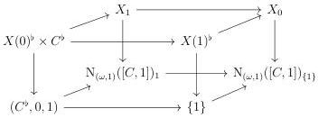

CHAPTER 6. THE \((\infty, \omega)\)-CATEGORY OF SMALL \((\infty, \omega)\)-CATEGORIES

Proposition 6.1.1.11. Let C be an  \( (\infty,\omega) \) -category, and E, F two objects of  \( \mathrm{LFib}(\mathrm{N}_{(\omega,1)}C) \)  corresponding to morphisms  \( X\to\mathrm{N}_{(\omega,1)}C \) ,  \( Y\to\mathrm{N}_{(\omega,1)}C \) . Let  \( \phi:E\to F \)  be a morphism. The following are equivalent:

(1) \(\phi\) is an equivalence,
(2) for any object \( x \) of \( C \), the induced morphism \( \mathbf{R}x^{*}\phi : \mathbf{R}x^{*}E \to \mathbf{R}x^{*}E \) is an equivalence,
(3) for any object \( x \) of \( C \), the induced morphism \( \phi(x): X(x) \to Y(x) \) is an equivalence,

Proof. The implication  \( (1) \Rightarrow (2) \)  is direct. The implication  \( (2) \Rightarrow (3) \)  comes from the fact that for any object x of C, the value on 0 of the simplicial object  \( Rx^{*}E \)  (resp.  \( Rx^{*}F \) ) is  \( X(x) \to 1 \)  (resp.  \( Y(x) \to 1 \) ).

Suppose now that \(\phi\) fulfills the last condition. As \(\mathrm{N}_{(\omega,1)}C\) is \(C_0\sim \coprod_{C_0}1\), we have equivalences

\[
X _ {0} \sim \coprod_ {x: C _ {0}} X (x) \quad Y _ {0} \sim \coprod_ {x: C _ {0}} Y (x).
\]

The morphism \(\phi_0: X_0 \to Y_0\) is then an equivalence. Eventually, as \(E\) and \(F\) are left fibrations, we have

\[
X _ {n} \sim X _ {\{0 \}} \times_ {(\mathrm{N} _ {(\omega , 1)} C) _ {\{0 \}}} (\mathrm{N} _ {(\omega , 1)} C) _ {n} \sim Y _ {\{0 \}} \times_ {(\mathrm{N} _ {(\omega , 1)} C) _ {\{0 \}}} (\mathrm{N} _ {(\omega , 1)} C) _ {n} \sim Y _ {n}.
\]

This implies  \( (3) \Rightarrow (1) \) , which concludes the proof.

Proposition 6.1.1.12. There is an equivalence natural in \(C: (\infty, \omega)\)-cat\(_{\mathrm{m}}^{op}\) between LFib(N\(_{(\omega,1)}[C,1]\)) and the \((\infty,1)\)-category whose objects are arrows of shape

\[
X (0) \times C \rightarrow X (1)
\]

and morphisms are natural transformations such that the induced morphism \( X(0) \times C \to Y(0) \times C \) is of shape \( f \times id_C \).

For a left fibration \( E \) corresponding to a morphism \( X \to [C,1] \), this arrow is the one appearing in the diagram:

where the left and the right squares are cartesian.

306