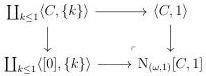
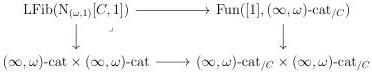
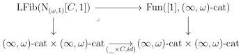
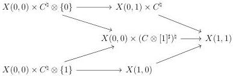

6.1. UNIVALENCE

Proof. Left fibrations are detected on pullback along representable. The functor  \( \mathrm{LFib}(\_) \)  then sends colimits of  \( \mathrm{Psh}^{\infty}(\Theta \times \Delta) \)  to limits. Remark that we have a cocartesian square

According to proposition 6.1.1.5, and as \(\mathrm{LFib}(\_)\) send colimits to limits, \(\mathrm{LFib}(\mathrm{N}_{(\omega,1)}[C,1])\) fits in the cartesian square

Using the adjunction

\[
\operatorname{dom}: (\infty , \omega) \text {-cat} _ {/ C} \xrightarrow [ \leftarrow ]{\perp} (\infty , \omega) \text {-cat}: _ {-} \times C
\]

the \((\infty,1)\)-category \(\mathrm{LFib}(\mathrm{N}_{(\omega,1)}[C,1])\) fits in the cartesian square

The first assertion then follows from the last cartesian square and the proposition 5.2.5.5 applied to \( I := 1 \). The second is obtained by walking through the equivalences used in the proof of proposition 6.1.1.5.

Proposition 6.1.1.13. There is an equivalence natural in \(C: (\infty, \omega)\)-cat\(_{\mathrm{m}}^{op}\) between LFib(([C, 1] \(\otimes\) [1]\(^{\sharp}\))\(^{\sharp}\)) and the \((\infty, 1)\)-category whose objects are diagrams of shape

such that \( X(0,0) \times C^{\sharp} \otimes \{0\} \to X(0,1) \times C^{\sharp} \) is of shape \( f \times id_{C^{\sharp}} \). Morphisms are natural transformations such that the induced morphisms \( X(0,1) \times C^{\sharp} \to Y(0,1) \times C^{\sharp} \) and \( X(0,0) \times (C \otimes [1]^{\sharp})^{\sharp} \to Y(0,0) \times (C \otimes [1]^{\sharp})^{\sharp} \) are of shape \( g \times C^{\sharp} \) and \( h \times (C \otimes [1]^{\sharp})^{\sharp} \).

307