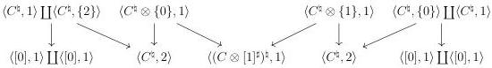
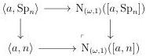
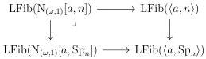

CHAPTER 6. THE \((\infty, \omega)\)-CATEGORY OF SMALL \((\infty, \omega)\)-CATEGORIES

Proof. The equation (5.1.3.9) implies that \(([C,1]\otimes [1]^{\sharp})^{\natural}\) is the colimit of the diagram

\[
[ 1 ] \vee [ C, 1 ] ^ {\natural} \longrightarrow [ C \otimes^ {\natural} \{0 \}, 1 ] \longleftarrow [ C \otimes [ 1 ] ^ {\sharp}, 1 ] ^ {\natural} \longleftarrow [ C ^ {\natural} \otimes \{1 \}, 1 ] \longrightarrow [ C, 1 ] ^ {\natural} \vee [ 1 ]
\]

According to proposition 5.1.1.37 and lemma 5.1.3.18, this colimit is special, and the \((\infty,1)\)-category \(\mathrm{N}_{(\omega,1)}([C,1] \otimes [1]^{\sharp})^{\natural}\) is then colimit, computed in \(\mathrm{Psh}(\Theta \times \Delta)\), of the diagram

We then deduce the result from the proposition 6.1.1.5 in the same way as in the previous proof.

Proposition 6.1.1.14. Let \( F: I \to (\infty, \omega) \)-cat be a W-small diagram. The canonical functor

\[
\operatorname{LFib} \left(\mathrm{N} _ {(\omega , 1)} \operatorname{colim} _ {I} F\right)\rightarrow \lim _ {I} \operatorname{LFib} \left(\mathrm{N} _ {(\omega , 1)} F\right)
\]

is an equivalence, where \(\operatorname{colim}_I F\) denotes the colimit taken in \((\infty, \omega)\)-cat.

Proof. Let \( C \) be an object of \( \mathrm{Psh}^{\infty}(\Theta) \). As left fibrations are detected by unique right lifting property against morphisms whose codomains are of shape \( \langle a, n \rangle \), a morphism \( p: X \to \mathrm{N}_{(\omega,1)}C \) is a left fibration if and only if for any \( i: [a, n] \to C \), \( (\mathrm{N}_{(\omega,1)}i)^{*}p \) is a left fibration. The functor

\[
\begin{array}{r c l} \mathrm{Psh} (\Delta [ \Theta ]) ^ {o p} & \to & (\infty , 1) \text {-cat} _ {\mathbf {W}} \\ X & \mapsto & \mathrm{LFib} (\mathrm{N} _ {(\omega , 1)} X) \end{array}
\]

then sends colimits to limits, where  \( (\infty,1) \) -cat \( _{W} \)  denotes the (huge)  \( (\infty,1) \) -category of W-small  \( (\infty,1) \) -categories. To conclude the proof, we then have to show that it sends any morphism  \( f \in M \)  to an equivalence. If f is of shape  \( [g,1] \)  for  \( g \in W \), this directly follows from proposition 6.1.1.12. Suppose now that f is  \( [a,Sp_{n}] \to [a,n] \). Remark that we have a cocartesian square:

The morphism \(\mathrm{LFib}(\mathrm{N}_{(\omega,1)}[a,\mathrm{Sp}_n])\to \mathrm{LFib}(\mathrm{N}_{(\omega,1)}[a,n])\) then fits in the cartesian square:

308