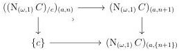
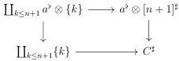

CHAPTER 6. THE \((\infty, \omega)\)-CATEGORY OF SMALL \((\infty, \omega)\)-CATEGORIES

The canonical morphism \(\mathbf{L}i_{!} \circ \int_{1} \to \int_{D} \circ \mathbf{L}(\mathrm{N}_{(\omega,1)} i)_{!}\) is then an equivalence, which implies by adjunction that \(\partial_{1} \circ \mathbf{R}_{i}^{*} \to \mathbf{R}(\mathrm{N}_{(\omega,1)} i)^{*} \circ \partial_{D}\) also is.

6.1.2.10. Let \( C \) be an \( (\infty, \omega) \)-category and \( c \) an object of \( C^\sharp \). We define \( (\mathrm{N}_{(\omega,1)}C)_{/c} \) as the simplicial object in \( (\infty, \omega) \)-cat whose value on \( (a, n) \) fits in the cocartesian square

Unfolding the definition, \((\mathrm{N}_{(\omega ,1)}C)_{/c}\) is the simplicial diagram whose value on \(n\) is

\[
\coprod_ {x _ {0}, \dots , x _ {n}} \hom_ {C} (x _ {0}, \dots , x _ {n}, c)
\]

Lemma 6.1.2.11. There is an equivalence

\[
\left(\left(\mathrm{N} _ {(\omega , 1)} C\right) _ {/ c}\right) ^ {\flat} \sim c ^ {*} \mathbf {F} h..
\]

Proof. A morphism \(\langle a, n \rangle \to (c^*\mathbf{F}h.)^\sharp\) is the data of a commutative square

which is, according to proposition 5.1.3.23, equivalent to a morphism

\[
[ a, n + 1 ] ^ {\sharp} \to C ^ {\sharp}
\]

and so to a morphism \(\langle a, n \rangle \to (\mathrm{N}_{(\omega,1)} C)_{c/}\). As \(c^*\mathbf{F}h\). has a trivial marking, this shows the desired equivalence.

Lemma 6.1.2.12. Let \( p: X \to \mathrm{N}_{(\omega,1)}C \) be a left fibration, and \( c \) an object of \( C \). The canonical morphism

\[
X (c) \to \underset {n} {\operatorname{colim}} (X \times_ {\mathrm{N} _ {(\omega , 1)} C} (\mathrm{N} _ {(\omega , 1)} C) _ {/ c}) _ {n}
\]

is an equivalence.

Proof. We will show a slightly stronger statement, which is that the morphism

\[
X (c) \to \underset {n} {\operatorname{colim}} (X \times_ {(\mathrm{N} _ {(\omega , 1)} C)} (\mathrm{N} _ {(\omega , 1)} C) _ {/ c}) _ {n}
\]

314