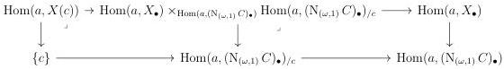

6.1. UNIVALENCE

is an equivalence when the colimit is taken in  \( \infty \) -presheaves on  \( \Theta \) . As the colimit in presheaves commutes with evaluation, one has to show that for any globular sum a, the canonical morphism of  \( \infty \) -groupoids

\[
\mathrm{Hom} (a, X (c)) \to \underset {n} {\mathrm{colim}} (\mathrm{Hom} (a, X _ {n}) \times_ {\mathrm{Hom} (a, (\mathrm{N} _ {(\omega , 1)} C) _ {n})} \mathrm{Hom} (a, (\mathrm{N} _ {(\omega , 1)} C) _ {/ c}) _ {n})
\]

is an equivalence. Remark that the simplicial \(\infty\)-groupoid \(\mathrm{Hom}(a, ((\mathrm{N}_{(\omega,1)}C)_{/c})_{\bullet})\) is equivalent to the simplicial \(\infty\)-groupoid \((\mathrm{Hom}(a, \mathrm{N}_{(\omega,1)}C)_{\bullet})_{/c}\). If we denote also by \(\mathrm{Hom}(a, X(c))\) the constant simplicial \(\infty\)-groupoid \(n \mapsto \mathrm{Hom}(a, X(c))\), we have a cartesian square

Moreover, the left vertical morphism is a left fibration of  \( (\infty,1) \) -category fibered in  \( \infty \) -groupoid. As pullbacks along left fibrations preserve final morphisms, the morphism

\[
\mathrm{Hom} (a, X (c)) \to \mathrm{Hom} (a, X _ {\bullet}) \times_ {\mathrm{Hom} (a, (\mathrm{N} _ {(\omega , 1)} C) _ {\bullet})} \mathrm{Hom} (a, (\mathrm{N} _ {(\omega , 1)} C) _ {\bullet}) _ {/ c}
\]

is final. Taking the colimit, this implies the result.

Lemma 6.1.2.13. Let \(i:C^{\sharp}\to D^{\sharp}\) be a morphism. The natural transformation

\[
\int_ {D} \circ \mathbf {R} (\mathrm{N} _ {(\omega , 1)} i) ^ {*} \rightarrow \mathbf {R} i ^ {*} \circ \int_ {C}
\]

is an equivalence.

Proof. As equivalences between left cartesian fibrations are detected on fibers, one can suppose that C is the terminal  \( (\infty,\omega) \) -category. Let c denote the object of D corresponding to i and let E be an object of  \( \mathrm{LFib}(\mathrm{N}_{(\omega,1)}C) \) , corresponding to a left fibration  \( X\to\mathrm{N}_{(\omega,1)}C \) . By construction,  \( \int_{C}E \)  is a colimit of left cartesian fibrations. However, as proposition 5.2.4.13 states that  \( Ri^{*} \)  commutes with colimit, we have

\[
\begin{array}{l} \mathbf {R} i ^ {*} \int_ {C} E \sim \operatorname{colim} _ {n} X _ {n} ^ {\flat} \times_ {(\mathrm{N} _ {(\omega , 1)} C) _ {n} ^ {\flat}} \mathbf {R} i ^ {*} \mathbf {F} h _ {\cdot} ^ {C} \\ \sim \operatorname{colim} _ {n} (X \times_ {\mathrm{N} _ {(\omega , 1)} C} (\mathrm{N} _ {(\omega , 1)} C) _ {/ c}) _ {n} ^ {\flat} \tag {6.1.2.11} \\ \end{array}
\]

Moreover, remark that \(\int_{1} \mathbf{R}(\mathrm{N}_{(\omega,1)} i)^{*} E\) is equivalent to \(X(c)\), and the canonical morphism \(\int_{D} \mathbf{R}(\mathrm{N}_{(\omega,1)} i)^{*} E \to \mathbf{R} i^{*} \int_{C} E\) is then the image by \((\_)^{\flat}\) of the equivalence given by lemma 6.1.2.12.

Proposition 6.1.2.14. The functors \(\int_{C}\) and \(\partial_C\) are natural in \(C:(\infty ,\omega)\)-cat\(^{op}\).

315