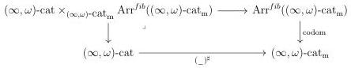
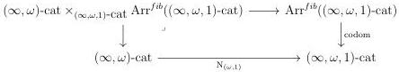
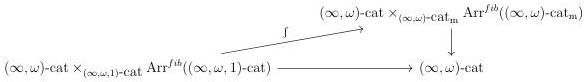
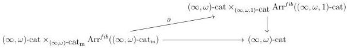

CHAPTER 6. THE \((\infty, \omega)\)-CATEGORY OF SMALL \((\infty, \omega)\)-CATEGORIES

Proof. We denote by \(\mathrm{Arr}^{fib}((\infty, \omega)\text{-cat}_{\mathfrak{m}})\) (resp. \(\mathrm{Arr}^{fib}((\infty, \omega, 1)\text{-cat})\)) the full sub \((\infty, 1)\)-category of \(\mathrm{Arr}((\infty, \omega)\text{-cat}_{\mathfrak{m}})\) (resp. \(\mathrm{Arr}((\infty, \omega, 1)\text{-cat})\)) whose objects are U-small left cartesian fibrations (resp. U-small left fibrations). We also set \((\infty, \omega)\text{-cat} \times_{(\infty, \omega)\text{-cat}_{\mathfrak{m}}} \mathrm{Arr}^{fib}((\infty, \omega)\text{-cat}_{\mathfrak{m}})\) and \((\infty, \omega)\text{-cat} \times_{(\infty, \omega, 1)\text{-cat}} \mathrm{Arr}^{fib}((\infty, \omega, 1)\text{-cat})\) as the pullbacks:

The two left vertical morphism inherit from the right vertical morphisms of a structure of Grothendieck fibrations fibered in  \( (\infty,1) \) -categories, where cartesian liftings are given by morphisms between arrows corresponding to cartesian squares.

As the assignation \( C \mapsto \mathbf{F}h^{C} \) can be promoted in a functor \( (\infty, \omega) \)-cat \( \to \operatorname{Arr}(\operatorname{Fun}(\Delta, (\infty, \omega) \text{-cat}_{\mathfrak{m}})) \) the functors \( \int_{C} \) and \( \partial_{C} \) are the restrictions of two functors \( \int \) and \( \partial \) fitting in commutative triangles:

Lemmas 6.1.2.9 and 6.1.2.13 imply that these two functors preserve cartesian arrows, and the Grothendieck deconstruction then implies the desired result. \(\square\)

Theorem 6.1.2.15. For any \((\infty, \omega)\)-category \(C\), the adjunction

\[
\int_ {C}: \mathrm{LFib} (\mathrm{N} _ {(\omega , 1)} C) \xrightarrow [ \leftarrow ]{\perp} \mathrm{LCart} (C ^ {\sharp}): \partial_ {C}
\]

defined in (6.1.2.8), is an adjoint equivalence.

316