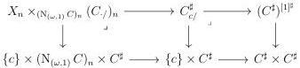
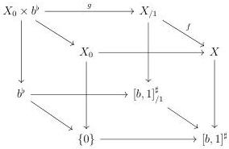

CHAPTER 6. THE \((\infty, \omega)\)-CATEGORY OF SMALL \((\infty, \omega)\)-CATEGORIES

natural in n, where  \( h_{n} \)  is the simplicial morphism preserving the extremal points. The outer square factors in two cartesian squares:

This provides a canonical morphism

\[
\int_ {C} E := \underset {n} {\mathrm{colim}} (X _ {n} \times_ {(\mathrm{N} _ {(\omega , 1)} C) _ {n}} (\mathbf {F} h.) _ {n}) \to \mathbf {F} h _ {c} ^ {C}
\]

To conclude, one has to show that it is an equivalence, and for this, to check that this is the case on fibers, where it directly follows from the naturality of the integral given in proposition 6.1.2.14.

Corollary 6.1.2.18. Let \( E \) be an object of \( (\infty, \omega) \)-cat\(_{/[b,1]^{\sharp}}\) corresponding to a morphism \( p: X \to [b,1]^{\sharp} \). Consider the induced cartesian squares:

The span associated to \(\partial_{[b,1]}\mathbf{F}E\) via the equivalence of proposition 6.1.1.12 is

\[
\bot X _ {0} \leftarrow (\bot X _ {0}) \times b \xrightarrow {\bot g} \bot X _ {/ 1}. \tag {6.1.2.19}
\]

Proof. We denote \(\tilde{X} \to [b,1]^{\sharp}\) the morphism associated to \(\mathbf{F}E\). As, As \([b,1]_{/1}^{\sharp} \to [b,1]^{\sharp}\) and \(\{0\} \to [b,1]^{\sharp}\) are right cartesian fibrations, they are smooth, and the canonical morphisms

\[
X _ {/ 1} \to \tilde {X} _ {/ 1} \qquad \mathrm{and} \qquad X _ {0} \to \tilde {X} _ {0}
\]

are initial. As  \( \perp \)  sends initial morphisms to equivalences, the induced morphisms

\[
\bot X _ {/ 1} \to \bot \tilde {X} _ {/ 1} \qquad \mathrm{and} \qquad \bot X _ {0} \to \bot \tilde {X} _ {0}
\]

are equivalences. We can then suppose that \( E \) corresponds to a left cartesian fibration.

318