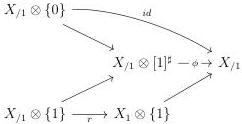
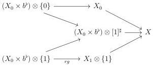
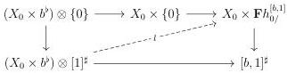
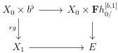

6.1. UNIVALENCE

As $\{1\} \to [b, 1]^{\sharp}$ is a right Gray deformation retract, so is the inclusion $X_1 \to X_{/1}$ according to proposition 5.2.1.13. The right Gray deformation retract structure induces a diagram:

By post composing with $g: X_0 \otimes b^{\flat} \to X_{/1}$ and post composing $f: X_{/1} \to X$, we get a diagram:

Remark furthermore that the following diagram:

admits a lift $l$. Indeed, the left vertical morphism is initial, and the right vertical one is a left cartesian fibration. All put together, we get a diagram

where the upper horizontal morphism is induced by the restriction of $l$ to $(X_0 \times b^{\flat}) \otimes \{1\}$. As $X_1 \to X_{/1}$ is initial, we have $\perp X_{/1} \sim \perp X_1$ and $\perp r$ is an equivalence. We denote by $F$ the left fibration associated to (6.1.2.19). The previous square then corresponds to a morphism

$$\int_{[b,1]} F \to E$$

Using the naturality of $\int_{[b,1]}$, one can see that this morphism induces an equivalence on fibers, and is then an equivalence. Applying $\partial_{[b,1]}$ and using theorem 6.1.2.15, this concludes the proof.

319