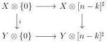
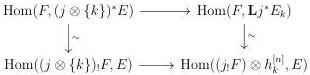

6.1. UNIVALENCE

Lemma 6.1.3.3. The functor \(\oint_{n,I}\) sends a natural transformation that is pointwise initial to an initial morphism.

Proof. As initial morphisms are closed under colimits, we have to show that for any integer \( k \), and any morphism \( E \to F \) of \( (\infty, \omega) \)-cat\(_{\mathrm{m}/I}\) corresponding to a sequence \( X \xrightarrow{i} Y \to I \), the induced morphism \( X \otimes [n - k]^{\sharp} \to Y \otimes [n - k]^{\sharp} \) over \( I \otimes [n]^{\sharp} \) is initial whenever \( i \) is. For this, remark that there is a square

where the two horizontal morphisms are initial. By stability by composition and left cancellation of initial morphism, this implies the result.

6.1.3.4. According to the last lemma, the adjunction (6.1.3.2) induces a derived adjunction

\[
\mathbf {L} \oint_ {n, I}: \operatorname{Fun} ([ n ], \operatorname{LCart} (I)) \xrightarrow [ \leftarrow ]{\perp} \operatorname{LCart} (I \otimes [ n ] ^ {\sharp}): \mathbf {R} \mathring {\partial} _ {n, I} \tag {6.1.3.5}
\]

where \(\mathbf{R}\mathring{\partial}_{n,I}\) is just the restriction of \(\mathring{\partial}_{n,I}\) to \(\mathrm{LCart}(I\otimes [n]^{\sharp})\).

Lemma 6.1.3.6. Let \( i:[n]^{\sharp}\to [m]^{\sharp} \) and \( j:I\to J \) be two morphisms. Let \( E \) be an object of \( \mathrm{LCart}(I\otimes [m]^{\sharp}) \). The natural transformation

\[
\mathring {\partial} _ {n, I} (j \otimes i) ^ {*} E \rightarrow j ^ {*} \circ \mathring {\partial} _ {m, J} E \circ i ^ {\natural}
\]

is an equivalence.

Proof. As invertible natural transformations are detected pointwise, one can suppose that \( n = 0 \), and let \( k \) be the image of [0] by \( i \). Let \( E_0 \to E_1 \to .. \to E_m \) be the sequence of morphisms of \( \mathrm{LCart}(J) \) corresponding to \( \mathring{\partial}_{m,J}E \).

The object \( j^{*} \circ \mathring{\partial}_{m,J} E \circ i^{\natural} \) is then equivalent to \( j^{*}E_{k} \) by definition. As \( \mathring{\partial}_{0,I} \) is the identity, we have to show that the canonical morphism \( (j \otimes \{k\})^{*}E \to j^{*}E_{k} \) is an equivalence. Remark that for any \( F \) of \( (\infty, \omega) \)-cat\(_{\mathrm{m}/I}\), we have by adjunction a commutative square:

where the two vertical morphisms are equivalences. As  \( ((j \otimes \{k\})_{!}F \sim (j_{!}F) \otimes h_{k}^{[n]} \) , the lower morphism is an equivalence, and so is the top one. This implies the desired result.

321