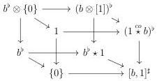
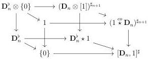
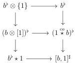
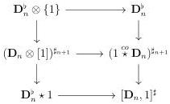

CHAPTER 6. THE \((\infty, \omega)\)-CATEGORY OF SMALL \((\infty, \omega)\)-CATEGORIES

6.1.3.16. We fix an object \(a\) of \(t\Theta\). We define \([a,1]^{\sharp} := ([a,1]^{\sharp})^{\sharp}\) and \(\iota\) the canonical inclusion \([a,1] \to [a,1]^{\sharp}\).

We directly have an equivalence

\[
\mathbf {L} \iota_ {!} \mathbf {R} \iota^ {*} \mathbf {F} h _ {1} ^ {[ a ^ {\sharp}, 1 ]} \sim \mathbf {F} h _ {1} ^ {[ a ^ {\sharp}, 1 ]}
\]

The next lemma provides an explicit expression for \(\mathbf{L}\iota_{!}\mathbf{R}\iota^{*}\mathbf{F}h_{0}^{[a^{\sharp},1]}\).

Lemma 6.1.3.17. Let \(a\) be an object of \(t\Theta\). We have an equivalence

\[
\mathbf {L} \iota_ {!} \mathbf {R} \iota^ {*} \mathbf {F} h _ {0} ^ {[ a ^ {\sharp}, 1 ]} \sim \mathbf {F} h _ {0} ^ {[ a ^ {\sharp}, 1 ]} \coprod_ {a ^ {\flat} \otimes \{0 \}} (a \otimes [ 1 ] ^ {\sharp}) ^ {\flat}.
\]

Moreover the morphism \(\mathbf{L}\iota_{!}(a^{\flat}\to \mathbf{F}h_{0}^{[a^{\sharp},1]})\) corresponds to the inclusion

\[
(a \otimes \{0 \}) ^ {\flat} \to (a \otimes [ 1 ] ^ {\sharp}) ^ {\flat} \to \mathbf {F} h _ {0} ^ {[ a ^ {\sharp}, 1 ]} \coprod_ {a ^ {\flat} \otimes \{0 \}} (a \otimes [ 1 ] ^ {\sharp}) ^ {\flat}.
\]

Proof. The theorem 5.2.3.10 implies that \(\iota_{!}\mathbf{R}\iota^{*}\mathbf{F}h_{0}^{[b,1]}\) and \(\iota_{!}\mathbf{R}\iota^{*}\mathbf{F}h_{0}^{(\mathbf{D}_{n})_{t},1]}\) are respectively equivalent to

\[
(1 \stackrel {c o} {\star} b) ^ {\flat} \to [ b, 1 ] ^ {\sharp} \quad \mathrm{and} \quad (1 \stackrel {c o} {\star} \mathbf {D} _ {n}) ^ {\sharp_ {n + 1}} \to [ \mathbf {D} _ {n}, 1 ] ^ {\sharp}
\]

The theorem 5.1.3.24 induces cartesian diagrams

Remark furthermore that we have an equivalence

\[
\bot (\mathbf {D} _ {n} \otimes [ 1 ]) ^ {\sharp_ {n + 1}} \sim \tau_ {n} ^ {\iota} (\mathbf {D} _ {n} \otimes [ 1 ]) =: ((\mathbf {D} _ {n}) _ {t} \otimes [ 1 ] ^ {\sharp}) ^ {\sharp}.
\]

Applying the full duality to theorem 5.2.3.10 and using the corollary 6.1.2.18, this proves the first assertion.

The second assertion follows from the naturality in E of the construction given in corollary 6.1.2.18 and from the squares

that are cartesian according to theorem 5.1.3.24.

□

324