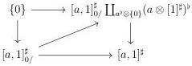
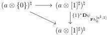
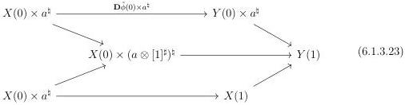

CHAPTER 6. THE \((\infty, \omega)\)-CATEGORY OF SMALL \((\infty, \omega)\)-CATEGORIES

where \(\iota\) is the canonical inclusion. As \(l\) and \(\iota\) are lifts in the following diagram:

they are equivalent. Taking the fiber on \(\{1\}\) of the cartesian square (6.1.3.21), this induces a commutative triangle:

Eventually, the naturality induces a commutative squares.

\[
\begin{array}{c} (a \otimes [ 1 ] ^ {\sharp}) ^ {\natural} \longrightarrow (a \otimes \{1 \}) ^ {\natural} \\ \left. \begin{array}{c} \{1 \} ^ {*} \mathbf {D} _ {\mathbf {F} h _ {0} ^ {[ a ^ {\natural}, 1 ]}} \Big \downarrow \\ (a \otimes [ 1 ] ^ {\sharp}) ^ {\natural} \longrightarrow (a \otimes \{1 \}) ^ {\natural} \end{array} \right. \end{array}
\]

The restriction of the morphism \(\mathbf{D}\psi_{\mathbf{F}h_0^{[a^{\sharp},1]}}\) to \(a\otimes \{0\}\) and \(a\otimes \{1\}\) is therefore the identity. Using Steiner theory, we can easily show that it forces \(\mathbf{D}\psi_{\mathbf{F}h_0^{[a^{\sharp},1]}}\) to also be the identity.

6.1.3.22. We fix an object \(F\) of \(\mathrm{LCart}([a,1]^{\sharp})\), and a morphism \(\phi : \mathbf{R}\iota^{*}E \to \mathbf{R}\iota^{*}F\). By adjunction, this corresponds to a morphism \(\tilde{\phi} : \iota_{!}\mathbf{R}\iota^{*}E \to F\), and as \(F\) corresponds to a left cartesian fibration, this induces a morphism \(\mathbf{D}\tilde{\phi} : \mathbf{L}\iota_{!}\mathbf{R}\iota^{*}E \to F\). Using once again theorem 6.1.2.15, this induces a morphism \(\partial_{[a^{\sharp},1]}\mathbf{L}\iota_{!}\mathbf{R}\iota^{*}E \to \partial_{[a^{\sharp},1]}F\), that corresponds, according to the explicit expression of \(\mathbf{L}\iota_{!}\mathbf{R}\iota\) given in (6.1.3.19), to a commutative square

\[
\begin{array}{c} X (0) \times a ^ {\natural} \xrightarrow {\mathbf {D} \tilde {\phi} (0) \times a ^ {\natural}} Y (0) \times a ^ {\natural} \\ \Big \downarrow \qquad \qquad \qquad \qquad \qquad \qquad \qquad \Big \downarrow \\ X (0) \times (a \otimes [ 1 ] ^ {\sharp}) ^ {\natural} \coprod_ {X (0) \times a ^ {\natural}} X (1) \xrightarrow [ \mathbf {D} \tilde {\phi} (1) ]{} Y (1) \end{array}
\]

where \( Y(0) \times a^{\flat} \to Y(1) \) corresponds to \( \partial_{[a^{\flat},1]}F \). This is equivalent to a diagram

326