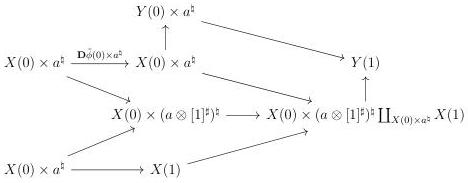

6.1. UNIVALENCE

According to proposition 6.1.1.13, this corresponds to an object \(\xi (\phi)\) of LFib \((\mathrm{N}_{(\omega ,1)}([a,1]\otimes [1]^{\sharp})^{\sharp}))\) endowed with two equivalences:

\[
\partial_ {[ a ^ {\natural}, 1 ]} E \sim \mathrm{N} _ {(\omega , 1)} ([ a, 1 ] \otimes \{0 \}) ^ {*} \xi (\phi) \qquad \partial_ {[ a ^ {\natural}, 1 ]} F \sim \mathrm{N} _ {(\omega , 1)} ([ a, 1 ] \otimes \{1 \}) ^ {*} \xi (\phi)
\]

Using the naturality of \(\int_{C}\) demonstrated in proposition 6.1.2.14, these equivalences induce equivalences:

\[
E \sim ([ a, 1 ] \otimes \{0 \}) ^ {*} \int_ {([ a, 1 ] \otimes [ 1 ] ^ {\sharp}) ^ {\sharp}} \xi (\phi) \quad F \sim ([ a, 1 ] \otimes \{1 \}) ^ {*} \int_ {([ a, 1 ] \otimes [ 1 ] ^ {\sharp}) ^ {\sharp}} \xi (\phi) \tag {6.1.3.24}
\]

All the operations we performed were functorial and admitted inverses. We then have constructed an equivalence

\[
\int_ {([ a, 1 ] \otimes [ 1 ] ^ {\sharp}) ^ {\sharp}} \xi : \operatorname{Fun} ^ {c} ([ 1 ], \operatorname{LCart} ([ a, 1 ])) \rightarrow \operatorname{LCart} (([ a, 1 ] \otimes [ 1 ] ^ {\sharp}) ^ {\sharp}) \tag {6.1.3.25}
\]

Lemma 6.1.3.26. There is a unique commutative square of shape

\[
\begin{array}{c} \iota_ {!} \iota^ {*} E \otimes \{0 \} \longrightarrow E \otimes \{0 \} \\ \Big \downarrow \quad \Big \downarrow \\ \iota_ {!} \iota^ {*} E \otimes i d _ {[ 1 ] ^ {\sharp}} \longrightarrow \int_ {([ a, 1 ] \otimes [ 1 ] ^ {\sharp}) ^ {\sharp}} \xi (\phi) \\ \uparrow \quad \uparrow \\ \iota_ {!} \iota^ {*} E \otimes \{1 \} \longrightarrow F \otimes \{1 \} \end{array} \tag {6.1.3.27}
\]

where the upper horizontal morphism is induced by the unit of the adjunction  \( (\iota_{!},\iota^{*}) \) . Moreover, the bottom horizontal morphism is  \( \tilde{\phi} \) .

Proof. The unicity and existence of the middle horizontal morphism come from the initiality of the morphism  \( \iota_{!}\iota^{*}E\otimes\{0\}\to\iota_{!}\iota^{*}E\otimes[1]^{\sharp} \) . The unicity and existence of the lower horizontal morphism is a consequence of the equation (6.1.3.24). As the diagram (6.1.3.23) factors as

327