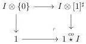

6.1. UNIVALENCE

6.1.3.30. We recall that a left cartesian fibration is U-small if its fibers are U-small  \( (\infty,\omega) \) -categories. For an  \( (\infty,\omega) \) -category A, we denote by  \( \mathrm{LCart}_{\mathbf{U}}(A^{\sharp}) \)  the full sub  \( (\infty,1) \) -category of  \( \mathrm{LCart}_{\mathbf{U}}(A^{\sharp}) \)  whose objects correspond to U-small left cartesian fibrations over  \( A^{\sharp} \) . For a marked  \( (\infty,\omega) \) -category I, we define similarly  \( \mathrm{LCart}_{\mathbf{U}}^{c}(I) \)  as the full sub  \( (\infty,1) \) -category of  \( \mathrm{LCart}_{\mathbf{U}}^{c}(I) \)  whose objects correspond to U-small classified left cartesian fibrations over I.

Corollary 6.1.3.31. Let \(\underline{\omega}\) be the V-small \((\infty, \omega)\)-category of U-small \((\infty, \omega)\)-categories. Let \(n\) be an integer and \(I\) be a V-small marked \((\infty, \omega)\)-category. We denote by \(I^{\sharp}\) the marked \((\infty, \omega)\)-category obtained from \(I\) by marking all cells, and \(\iota: I \to I^{\sharp}\) the induced morphism. There is an equivalence, natural in \([n]: \Delta^{op}\) and \(I: (\infty, \omega)\)-cat\(_{\mathrm{m}}^{op}\), between functors

\[
f: I \otimes [ n ] ^ {\sharp} \to \underline {{\omega}} ^ {\sharp}
\]

and sequences

\[
\iota^ {*} \int_ {I ^ {\natural}} f _ {0} \rightarrow \dots \rightarrow \iota^ {*} \int_ {I ^ {\natural}} f _ {n}
\]

where for any \(k \leq n\), \(f_{k}\) is the functor \(I^{\natural} \to \underline{\omega}\) induced by \(I \otimes \{k\} \to I \otimes [n]^{\sharp} \to \underline{\omega}^{\sharp}\).

Proof. This is a direct application of the equivalence

\[
\tau_ {0} \mathrm{LCart} ((I \otimes [ n ] ^ {\sharp}) ^ {\sharp}) \to \mathrm{Hom} ([ n ], \mathrm{LCart} ^ {c} (I))
\]

induced by proposition 6.1.3.29.

Corollary 6.1.3.32. Let \(I\) be a \(\mathbf{V}\)-small marked \((\infty, \omega)\)-category and \(c\) an object of \(\underline{\omega}\). We denote by \(I^{\sharp}\) the marked \((\infty, \omega)\)-category obtained from \(I\) by marking all cells, and \(\iota: I \to I^{\sharp}\) the induced morphism. There is an equivalence, natural in \(I: (\infty, \omega)\)-cat\(_{\mathrm{m}}^{op}\), between functors

\[
f: I \to \underline {{\omega}} _ {c /} ^ {\sharp}
\]

and arrows:

\[
I \times \int_ {1} c \rightarrow \iota^ {*} \int_ {I ^ {\natural}} \tilde {f}
\]

where \(\tilde{f}\) is the induced functor \(I^{\natural} \to \underline{\omega}_{c/} \to \underline{\omega}\).

Proof. By construction, we have a cocartesian square.

As \(\tau_0\mathrm{LCart}(\_)\) sends colimits to limits, this is a consequence of the last corollary.

329