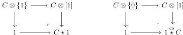
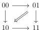
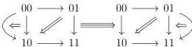

CHAPTER 1. THE CATEGORY OF (0, ω)-CATEGORIES

(0, ω)-category C onto the following pushouts:

We also present a formula that illustrates the interaction between the suspension and the Gray cylinder. As this formula plays a crucial role in both Part I and Part II, we provide its intuition at this stage.

If A is any (0, ω)-category, the suspension of A, denoted by [A, 1], is the (0, ω)-category having two objects - denoted by 0 and 1- and such that

$$\operatorname{Hom}_{[A,1]}(0, 1) := A, \quad \operatorname{Hom}_{[A,1]}(1, 0) := \emptyset, \quad \operatorname{Hom}_{[A,1]}(0, 0) = \operatorname{Hom}_{[A,1]}(1, 1) := \{id\}.$$

We also define [1] ∨ [A, 1] as the gluing of [1] and [A, 1] along the 0-target of [1] and the 0-source of [A, 1]. We define similarly [A, 1] ∨ [1]. These two objects come along with whiskerings:

$$\nabla : [A, 1] \rightarrow [1] \vee [A, 1] \quad \text{and} \quad \nabla : [A, 1] \rightarrow [A, 1] \vee [1]$$

that preserve the extremal objects.

The (0, ω)-category [1] ⊗ [1] is induced by the diagram:

and is then equal to the colimit of the following diagram:

$$[1] \vee [1] \xleftarrow{\nabla} [1] \hookrightarrow [[1], 1] \hookleftarrow [1] \xrightarrow{\nabla} [1] \vee [1].$$

The (0, ω)-category [[1], 1] ⊗ [1] is induced by the diagram:

and is then equal to the colimit of the following diagram:

$$[1] \vee [[1], 1] \xleftarrow{\nabla} [[1] \otimes \{0\}, 1] \hookrightarrow [[1] \otimes [1], 1] \hookleftarrow [[1] \otimes \{1\}, 1] \xrightarrow{\nabla} [[1], 1] \vee [1]$$

We prove a formula that combines these two examples:

24