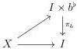

CHAPTER 6. THE \((\infty, \omega)\)-CATEGORY OF SMALL \((\infty, \omega)\)-CATEGORIES

coming along with equivalences:  \( (\epsilon \circ_{0} f^{*}) \circ_{1} (f^{*} \circ_{0} \mu) \sim id_{f^{*}} \)  and  \( (f_{*} \circ_{0} \epsilon) \circ_{1} (\mu \circ_{0} f_{*}) \sim id_{f_{*}} \) . Moreover, for every morphism  \( j : C \to D^{\sharp} \) , (5.2.5.20) induces a canonical commutative square

\[
\begin{array}{c} \underline {{\mathrm{Hom}}} _ {\ominus} (D ^ {\sharp} \times I, \underline {{\omega}}) \xrightarrow {(i d _ {D ^ {\sharp}} \times f) !} \underline {{\mathrm{Hom}}} (D \times A, \underline {{\omega}}) \\ (j \times i d _ {I}) ^ {*} \Big \downarrow \qquad \qquad \qquad \qquad \qquad \qquad \qquad \Big \downarrow (j \times i d _ {A ^ {\sharp}}) ^ {*} \\ \underline {{\mathrm{Hom}}} _ {\ominus} (C ^ {\sharp} \times I, \underline {{\omega}}) \xrightarrow {(i d _ {C ^ {\sharp}} \times f) !} \underline {{\mathrm{Hom}}} (C \times A, \underline {{\omega}}) \end{array}
\]

and when \( f \) is proper, (5.2.5.30) induces a canonical commutative square

\[
\begin{array}{c} \underline {{\mathrm{Hom}}} _ {\ominus} (D ^ {\sharp} \times I, \underline {{\omega}}) \xrightarrow {(i d _ {D ^ {\sharp}} \times f) _ {*}} \underline {{\mathrm{Hom}}} (D \times A, \underline {{\omega}}) \\ (j \times i d _ {I}) ^ {*} \Big \downarrow \qquad \qquad \qquad \qquad \qquad \qquad \Big \downarrow (j \times i d _ {A ^ {\sharp}}) ^ {*} \\ \underline {{\mathrm{Hom}}} _ {\ominus} (C ^ {\sharp} \times I, \underline {{\omega}}) \xrightarrow {(i d _ {C ^ {\sharp}} \times f) _ {*}} \underline {{\mathrm{Hom}}} (C \times A, \underline {{\omega}}) \end{array}
\]

##### 6.1.4.5. We now turn our attention back to the proof of the theorem 6.1.4.2.

Lemma 6.1.4.6. Let \(I\) be a marked \((\infty, \omega)\)-category and \(b^{\flat}\) a globular sum. We denote by \(\pi_b: I \times b^{\flat} \to I\) the canonical projection. There is an equivalence of \((\infty, 1)\)-categories:

\[
\operatorname{LCart} (I \times b ^ {\flat}) \sim \operatorname{LCart} (I) _ {/ \pi_ {b}}
\]

Proof. Remark first that we have an equivalence

\[
((\infty , \omega) \text {-cat} _ {\mathrm{m} / I}) _ {/ \pi_ {b}} \sim (\infty , \omega) \text {-cat} _ {\mathrm{m} / I \times b}
\]

Now suppose given a triangle

As left cartesian fibrations are stable by composition and right cancellation, and as  \( \pi_{b} \)  is a left cartesian fibration, the diagonal morphism is a left cartesian fibration if and only if the horizontal morphism is.

The \((\infty,1)\)-categories \(\mathrm{LCart}(I)_{/\pi_b}\) and \(\mathrm{LCart}(I\times b^{\flat})\) then identity with the same full sub \((\infty,1)\)-category of \(((\infty,\omega)\text{-cat}_{\mathrm{m}/I})_{/\pi_b}\sim (\infty,\omega)\text{-cat}_{\mathrm{m}/I\times b}\).

Lemma 6.1.4.7. There is a family of cartesian squares

\[
\begin{array}{c} \tau_ {0} \mathrm{LCart} ([ a \times b, n ] ^ {\sharp}) \longrightarrow \tau_ {0} \mathrm{LCart} ([ a, n ] ^ {\sharp} \times b ^ {\flat}) \\ \Big \downarrow \qquad \qquad \qquad \qquad \qquad \qquad \Big \downarrow \\ \prod_ {k \leq n} \tau_ {0} \mathrm{LCart} (\{k \}) \longrightarrow \prod_ {k \leq n} \tau_ {0} \mathrm{LCart} (\{k \} \times b ^ {\flat}) \end{array}
\]

natural in \(a, b\) and \(n\).

332