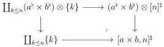
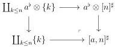
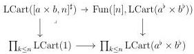
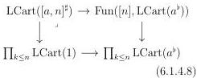
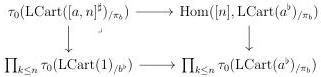
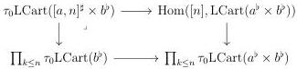
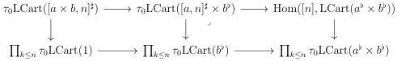

6.1. UNIVALENCE

Proof. Remark first that the proposition 5.1.3.23 provides cocartesian squares:

According to the corollary 6.1.2.16, and proposition 6.1.3.29, and as \(\mathbf{R}(\pi_{-})_{!}:\mathrm{LCart}(1)\to\) \(\mathrm{LCart}_{(-}^{\flat})\) factors through \(\mathrm{LCart}^c (\_ ^b)\), this induces cartesian squares:

For a marked  \( (\infty,\omega) \) -category I, we denote  \( \pi_{b}:I\times b\to I \)  the canonical projection. As the  \( (\infty,1) \) -categorical slice and the maximal full sub  \( \infty \) -groupoid preserve cartesian squares, the second cartesian square induces a cartesian square

and according to lemma 6.1.4.6, this corresponds to a cartesian square

Combined with the first cartesian square of (6.1.4.8), this induces a commutative diagram

where the right and the outer square are cartesian. By right cancellation, the left square is cartesian which concludes the proof.

□

333