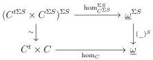
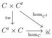
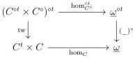

CHAPTER 6. THE \((\infty, \omega)\)-CATEGORY OF SMALL \((\infty, \omega)\)-CATEGORIES

6.2.1.8. We define the  \( (\infty,\omega) \) -category of  \( (\infty,\omega) \) -presheaves on C :

\[
\widehat {C} := \underline {{\mathrm{Hom}}} (C ^ {t}, \underline {{\omega}}).
\]

This \((\infty, \omega)\)-category is locally \(\mathbf{U}\)-small according to proposition 6.2.1.3. The Yoneda embedding \(y: C \to \widehat{C}\) is the functor induced by the hom functor (6.2.1.7) by currying.

An  \( (\infty,\omega) \) -presheaves is representable if it is in the image of y.

6.2.1.9. We recall that for a subset S of  \( N^{*} \) , and an object X of  \( (\infty,\omega,1) \) -cat, we denote by  \( X^{S} \)  the simplicial object  \( n\mapsto X_{n}^{S} \) . We also set  \( \Sigma S:=\{i+1,i\in S\} \) . We then have equivalences

\[
(\mathrm{N} _ {(\omega , 1)} C) ^ {S} \sim \mathrm{N} _ {(\omega , 1)} (C ^ {\Sigma C}) \quad \mathrm{and} \quad S (\mathrm{N} _ {(\omega , 1)} C)) ^ {S} \sim S (\mathrm{N} _ {(\omega , 1)} (C ^ {\Sigma C}))
\]

For an object \( X \) of \( (\infty, \omega, 1) \)-cat, we denote by \( X_{op} \) the simplicial object \( n \mapsto X_{n^{op}} \). We then have equivalences

\[
(\mathrm{N} _ {(\omega , 1)} C) _ {o p} \sim \mathrm{N} _ {(\omega , 1)} (C ^ {t}) \quad \mathrm{and} \quad S (\mathrm{N} _ {(\omega , 1)} C)) _ {o p} \sim S (\mathrm{N} _ {(\omega , 1)} (C ^ {t}))
\]

Using the dualities defined in paragraph 6.1.1.20, we then have commutative diagrams

where tw is the functor exchanging the argument. This two diagram corresponds to the natural transformations

\[
\hom_ {C ^ {\Sigma S}} (x, y) \sim \hom_ {C} (x, y) ^ {S} \quad \mathrm{and} \quad \hom_ {C ^ {t}} (x, y) \sim \hom_ {C} (y, x).
\]

In combining the two previous diagrams, we get a commutative square:

corresponding to the natural transformation

\[
\hom_ {C ^ {\circ}} (x, y) \sim \hom_ {C} (y, x) ^ {\circ}.
\]

338