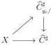

CHAPTER 6. THE \((\infty, \omega)\)-CATEGORY OF SMALL \((\infty, \omega)\)-CATEGORIES

where \(\tilde{g}\) is the morphism defined by currying from \(g^{\sharp}: X^{\sharp} \to \widehat{C}\). Using the naturality of the Grothendieck construction, the previous commutative square implies that the data of (6.2.1.12) corresponds to a morphism

\[
i d _ {X} \rightarrow (\iota \times \{c \}) ^ {*} \int_ {X ^ {\natural} \times C ^ {t}} \tilde {g}
\]

an by adjunction, to a morphism

\[
X \times \mathbf {F} h _ {c} ^ {C ^ {t}} \rightarrow (\iota \times (C ^ {t}) ^ {\sharp}) ^ {*} \int_ {X ^ {\natural} \times C ^ {t}} \tilde {g}
\]

We then have constructed an equivalence

\[
\operatorname{Hom} (E, \int_ {\widehat {C}} \mathrm{ev} (c, \_) \sim \operatorname{Hom} (X \times \mathbf {F} h _ {c} ^ {C ^ {t}}, (\iota \times (C ^ {t}) ^ {\sharp}) ^ {*} \int_ {X ^ {\natural} \times C ^ {t}} \tilde {g}) \tag {6.2.1.13}
\]

natural in \(E\).

Remark furthermore that if \( E \) is \( h_f^{\widehat{C}} \) for \( f \) an object of \( \widehat{C} \), the equivalence corresponds to the canonical equivalences

\[
\begin{array}{l} \mathrm{Hom} _ {(\infty , \omega) \text {-cat} _ {\mathrm{m} / \widehat {C} ^ {\sharp}}} (h _ {f} ^ {\widehat {C}}, \int_ {\widehat {C}} \mathrm{ev} (c, \_) \sim \mathrm{Hom} _ {(\infty , \omega) \text {-cat} _ {\mathrm{m}}} (1, \{f \} ^ {*} \int_ {\widehat {C}} \mathrm{ev} (c, \_) \\ \sim \mathrm{Hom} _ {(\infty , \omega) \text {-cat} _ {\mathrm{m}}} (1, c ^ {*} \int_ {C ^ {t}} f) \\ \sim \mathrm{Hom} _ {(\infty , \omega) \text {-cat} _ {\mathrm{m} / (C ^ {t}) ^ {\sharp}}} (\mathbf {F} h _ {c} ^ {C ^ {t}}, \int_ {C ^ {t}} f) \\ \end{array}
\]

Proposition 6.2.1.14. For any object \( c \) of \( C \), there exists a unique pair consisting of a morphism

\[
\int_ {\widehat {C}} \mathrm{hom} _ {\widehat {C}} (y _ {c}, \_) \rightarrow \int_ {\widehat {C}} \mathrm{ev} (c, \_)
\]

and a commutative square of shape

\[
\begin{array}{c} \left\{i d _ {y _ {c}} \right\} \longrightarrow \hom_ {\widehat {C}} \left(y _ {c}, y _ {c}\right) \sim \left\{y _ {c} \right\} ^ {*} \int_ {\widehat {C}} \hom_ {\widehat {C}} \left(y _ {c}, \_ \right) \\ \Big \| \quad \Big \downarrow \\ \left\{i d _ {c} \right\} \longrightarrow \hom_ {C} (c, c) \sim \left\{y _ {c} \right\} ^ {*} \int_ {\widehat {C}} \operatorname{ev} (c, \_) \end{array} \tag {6.2.1.15}
\]

Moreover, this comparison morphism is an equivalence.

Proof. The proposition 6.2.1.10 implies that \(\int_{\widehat{C}}\mathrm{hom}_{\widehat{C}}(y_c,\_)\) is equivalent to \(\mathbf{F}h_{y_c}^{\widehat{C}}\). A natural transformation \(\int_{\widehat{C}}\mathrm{hom}_{\widehat{C}}(y_c,\_) \to g\) then corresponds to a morphism \(\mathbf{F}h_{y_c}^{\widehat{C}} \to \int_{\widehat{C}}g\) and is then uniquely characterized by the value on \(\{id_{y_c}\}\), which proves the uniqueness.

It remains to show the existence. Let \( E \) be an object of \( (\infty, \omega) \)-cat\(_{\mathrm{m} / \widehat{C}^{\sharp}}\) corresponding to a morphism \( g: X \to \widehat{C}^{\sharp} \). We denote \( \iota: X \to X^{\sharp} \) the canonical inclusion. According to proposition 6.2.1.10, a morphism \( E \to \int_{\widehat{C}} \mathrm{hom}_{\widehat{C}}(y_c, \_) \) corresponds to a morphism \( E \to \mathbf{F}h_{y_c}^{\widehat{C}} \), and so to a triangle

340