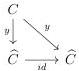
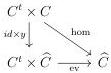

CHAPTER 6. THE \((\infty, \omega)\)-CATEGORY OF SMALL \((\infty, \omega)\)-CATEGORIES

Lemma 6.2.1.17. Let \(i: C \to D\) be a morphism between locally \(\mathbf{U}\)-small \((\infty, \omega)\)-categories. The canonical morphism of \(\mathrm{LCart}((C^t)^\sharp \times D^\sharp)\):

\[
\mathbf {L} (i d \times i)! \int_ {C ^ {t} \times C} \hom_ {C} \rightarrow \int_ {C ^ {t} \times D} \hom_ {D} (i (\_, \_)
\]

is an equivalence.

Proof. Let \( c, d \) be any objects of respectively \( C \) and \( D \). We then have equivalences

\[
\mathbf {R} (c, d) ^ {*} \mathbf {L} (i d \times i)! \int_ {C ^ {t} \times C ^ {t}} \hom_ {C} \sim \mathbf {R} \{d \} ^ {*} \mathbf {L} i _ {!} \mathbf {R} (i d \times \{c \}) ^ {*} \int_ {C ^ {t} \times C} \hom_ {C} \tag {5.2.4.24}
\]

\[
\sim \quad \mathbf {R} \{d \} ^ {*} \mathbf {L} i _ {!} \mathbf {F} h _ {c} ^ {C} \tag {6.2.1.10}
\]

\[
\sim \mathbf {R} \{d \} ^ {*} \mathbf {F} h _ {i (c)} ^ {D}
\]

\[
\sim \hom_ {D} (i (c), d) ^ {\flat}
\]

Remark that we also have an equivalence

\[
\mathbf {R} (c, d) ^ {*} \int_ {C ^ {t} \times D} \hom_ {D} (i (\_, \_) \sim \hom_ {D} (i (c), d) ^ {\flat}
\]

and that the induced endomorphism of \(\mathrm{hom}_D(i(c),d)^b\) is the identity. As equivalences are detected pointwise, this concludes the proof.

Theorem 6.2.1.18. Let \( C \) be a locally \( \mathbf{U} \)-small \( (\infty, \omega) \)-category. There is an equivalence between the functor

\[
\hom_ {\widehat {C}} (y _ {\_, \_}): C ^ {t} \times \widehat {C} \to \underline {{\omega}}
\]

and the functor

\[
\operatorname{ev}: C ^ {t} \times \widehat {C} \to \underline {{\omega}}.
\]

Restricted to \(\widehat{C} \times \{c\}\) for \(c\) an object of \(C\), this equivalence is the one of proposition 6.2.1.14.

Proof. The triangle

induces by adjunction a triangle

This corresponds to an equivalence

\[
\int_ {C ^ {t} \times C} \hom_ {C} (\_, \_) \rightarrow (i d \times y) ^ {*} \int_ {C ^ {t} \times \widehat {C}} \mathrm{ev}.
\]

342