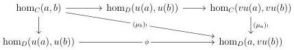
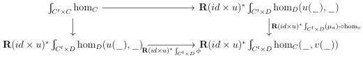
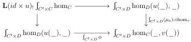

CHAPTER 6. THE \((\infty, \omega)\)-CATEGORY OF SMALL \((\infty, \omega)\)-CATEGORIES

Lemma 6.2.2.12. The natural transformation

\[
\hom_ {D} (u (a), b) \to \hom_ {C} (v u (a), v (b)) \xrightarrow {(\mu_ {a}) !} \hom_ {C} (a, v (b))
\]

is equivalent to \(\phi : \hom_D(u(a), b) \to \hom_D(a, v(b))\). Similarly, the natural transformation

\[
\hom_ {C} (a, v (b)) \to \hom_ {D} (u (a), u v (b)) \xrightarrow {(\epsilon_ {b}) !} \hom_ {D} (u (a), b)
\]

is equivalent to \(\phi^{-1}:\hom_D(a,v(b))\to \hom_D(u(a),b)\).

Proof. Remark that we have a commutative diagram

The commutativity of the left triangle comes from the definition of  \( \mu \) , and the second one, from the lemma 6.2.2.4, applied to  \( \mu \) . This then induces a commutative square

By adjunction, this corresponds to a commutative square

However, the top horizontal and left vertical morphisms are equivalences according to lemma 6.2.1.17. We then have an equivalence

\[
\int_ {C ^ {t} \times D} (\mu_ {a}) _ {!} \circ \mathrm{hom} _ {v} \sim \int_ {C ^ {t} \times D} \phi
\]

which implies the result. The other assertion is shown similarly.

Lemma 6.2.2.13. There are equivalences \((\epsilon \circ_0 u) \circ_1 (u \circ_0 \mu) \sim id_u\) and \((v \circ_0 \epsilon) \circ_1 (\mu \circ_0 v) \sim id_v\).

348