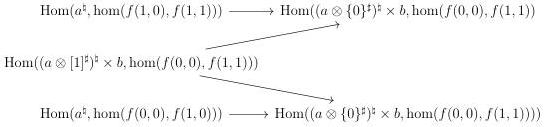

CHAPTER 6. THE \((\infty, \omega)\)-CATEGORY OF SMALL \((\infty, \omega)\)-CATEGORIES

6.2.3.4. For I a marked  \( (\infty,\omega) \) -category and A an  \( (\infty,\omega) \) -category, we recall that  \( \underline{\mathrm{Hom}}_{\ominus}(I,A) \)  is the  \( (\infty,\omega) \) -category whose value on a globular sum a is given by:

\[
\mathrm{Hom} (a, \underline {{\mathrm{Hom}}} _ {\ominus} (I, A)) := \mathrm{Hom} (I \ominus a ^ {\sharp}, A ^ {\sharp})
\]

Remark 6.2.3.5. Let \( B \) be an \( (\infty, \omega) \)-category. We want to give an intuition of the object \( \underline{\mathrm{Hom}}_{\ominus}(B^{\flat}, \omega) \). The objects of this \( (\infty, \omega) \)-category are the functors \( I \to \omega \). The 1-cells are the lax transformations \( F \Rightarrow G \). For \( n > 1 \), the \( n \)-cells are the lax transformations \( F^{\times \mathbf{D}_{n-1}} \Rightarrow G \) where \( F^{\times \mathbf{D}_{n-1}}: I \to \omega \) is the functor that sends \( i \) onto \( F(i) \times \mathbf{D}_{n-1} \). This last assertion is a consequence of the equivalence

\[
\tau_ {0} (\mathrm{LCart} ((I \ominus [ b, n ] ^ {\sharp}) ^ {\sharp}) \sim \mathrm{Hom} ([ n ], \mathrm{LCart} ^ {c} (I; b))
\]

provided by the lemma 6.1.4.12.

Proposition 6.2.3.6. If \( I \) is U-small and \( A \) is locally U-small, the \( (\infty, \omega) \)-category \( \underline{\mathrm{Hom}}_{\ominus}(I, A) \) is locally U-small.

Proof. We have to check that for any globular sum \( b \), the morphism

\[
\operatorname{Hom} (I \ominus [ b, 1 ] ^ {\sharp}, A ^ {\sharp}) \to \operatorname{Hom} (I \ominus (\{0 \} \amalg \{1 \}), A ^ {\sharp})
\]

has U-small fibers. As I, seen as an  \( \infty \) -presheaves on  \( t\Theta \) , is a U-small colimit of representatives, we can reduce to the case where  \( I \in t\Theta \) . As A is local with respect to Segal extensions, and as  \( \ominus \)  conserves them, we can reduce to the case where I is of shape  \( [1]^{\sharp} \)  or  \( [a,1] \)  for a in  \( t\Theta \) . If I is  \( [1]^{\sharp} \) , according to the second assertion of proposition 5.1.3.16,  \( [1]^{\sharp} \ominus [b,1]^{\sharp} \)  is equivalent to  \( ([1] \times [b,1])^{\sharp} \)  and the result follows from proposition 6.2.1.3.

For the second case, we fix a morphism \( f:[a,1]\times (\{0\} \amalg \{1\})\to A \). Using the canonical equivalence between \([a,1]\ominus [b,1]^{\sharp}\) and the colimit of the diagram (5.1.3.14), the \(\infty\)-groupoid \(\mathrm{Hom}(I\ominus [b,1]^{\sharp},A^{\sharp})_f\) is the limit of the diagram:

As all these objects are U-small by assumption, this concludes the proof.

□

350