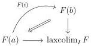
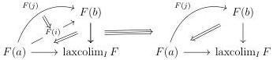

6.2. YONEDA LEMMA AND APPLICATIONS

6.2.3.7. Let I be a U-small marked  \( (\infty,\omega) \) -category, A a locally U-small  \( (\infty,\omega) \) -category A and  \( F:I\to A^{\sharp} \)  a functor. A lax colimit of F is an object laxcolim \( _{I} \)  F of A together with an equivalence

\[
\hom_ {A} (\underset {I} {\text { laxcolim }} F, b) \sim \hom_ {\underline {{\text { Hom }}} _ {\square} (I, A)} (F, \text { cst } b)
\]

natural in \( b: A \). Conversely, a lax limit of \( F \) is an object laxlim\(_I\) \( F \) of \( A \) together with an equivalence

\[
\hom_ {A} (b, \underset {I} {\text { laxlim }} F) \sim \hom_ {\underline {{\text { Hom }}} _ {\square} (I, A)} (\text { cst } b, F)
\]

natural in \( b: A \). We say that a locally U-small \( (\infty, \omega) \)-category \( C \) is lax U-complete (resp. lax U-cocomplete), if for any U-small marked \( (\infty, \omega) \)-category \( I \) and any functor \( F: I \to C \), \( F \) admits limits (resp. colimits).

Using proposition 6.2.2.2, C is lax U-complete (resp. lax U-cocomplete) if and only if for any U-small marked  \( (\infty,\omega) \) -category I, the functor  \( \operatorname{cst}:C\to\underline{\operatorname{Hom}}_{\square}(I,C) \)  admits a right adjoint (resp. a left adjoint).

The proposition 5.1.3.15 induces an equivalence

\[
\underline {{\mathrm{Hom}}} _ {\square} (I, A) ^ {\circ} \sim \underline {{\mathrm{Hom}}} _ {\square} (I ^ {\circ}, A ^ {\circ})
\]

As a consequence, a functor  \( F: I \to A^{\sharp} \)  admits a lax colimit if and only if  \( F^{\circ}: I^{\circ} \to (A^{\circ})^{\sharp} \)  admits a lax limit. If F admits such lax colimit, the lax limit of  \( F^{\circ} \)  is the image by the canonical equivalence  \( A_{0} \sim A_{0}^{\circ} \)  of the lax colimit of F.

Remark 6.2.3.8. We want to give an intuition of the lax colimits. Let I be a U-small marked  \( (\infty,\omega) \) -category, A a locally U-small  \( (\infty,\omega) \) -category A and  \( F:I\to A^{\sharp} \)  a functor admitting a lax colimit laxcolim \( _{I} \)  F. For any 1-cell  \( i:a\to b \)  in I, we have a triangle

If \( i \) is marked, the preceding 2-cell is an equivalence. For any 2-cell \( u: i \to j \), we have a diagram

If u is marked, the 3-cell is an equivalence. We can continue these diagrams in higher dimensions and we have similar assertions for lax limits.

The marking therefore allows us to play on the "lax character" of the universal property that the lax colimit must verify.

351