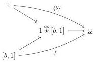
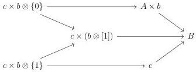

CHAPTER 6. THE \((\infty, \omega)\)-CATEGORY OF SMALL \((\infty, \omega)\)-CATEGORIES

Example 6.2.3.14. Using the explicit expression of lax limit given above, we have an equivalence

\[
\underset {I} {\mathrm{laxlim}} g \sim \mathrm{Map} (i d _ {I}, \iota^ {*} \int_ {I ^ {\sharp}} g ^ {\sharp})
\]

- Let \( c: 1 \to \underline{\omega} \) be a morphism corresponding to an \( (\infty, \omega) \)-category \( C \). For any \( (\infty, \omega) \)-category \( A \), we then have

\[
\underset {A ^ {\sharp}} {\mathrm{laxlim}} \operatorname{cst} _ {c} \sim \underline {{\mathrm{Hom}}} (\tau_ {0} A, C) \qquad \underset {A ^ {\flat}} {\mathrm{laxlim}} \operatorname{cst} _ {c} \sim \underline {{\mathrm{Hom}}} (A, C)
\]

- Let \( f:[b,1] \to \underline{\omega} \) be a morphism corresponding to a morphism \( A \times b \to B \). Let \( c \) be a globular sum. According to corollary 6.1.3.32, a morphism \( id_{[b,1]^{\flat}} \times c^{\flat} \to \iota^{*} \int_{[b,1]^{\flat}} g^{\sharp} \) corresponds to a diagram

and according to proposition 6.1.1.13, to a diagram

where the upper horizontal morphism is of shape  \( g \times b \) . We then have

\[
\underset {[ b, 1 ] ^ {\flat}} {\text { laxlim }} f \sim A \prod_ {\operatorname{Hom} (b, B)} \operatorname{Hom} (b \star 1, B).
\]

Proposition 6.2.3.15. Let \(i: I \to J\) be a morphism between \(\mathbf{U}\)-small marked \((\infty, \omega)\)-categories, \(A\) a \(\mathbf{U}\)-small \((\infty, \omega)\)-category and \(f: J \to \widehat{A}^{\sharp}\) a morphism. If \(i\) is final, then the canonical morphism

\[
\underset {I} {\text { laxcolim }} f \circ i \to \underset {J} {\text { laxcolim }} f
\]

is an equivalence.

If \(i\) is initial, then the canonical morphism

\[
\underset {J} {\mathrm{laxlim}} f \to \underset {I} {\mathrm{laxlim}} f \circ i
\]

is an equivalence.

354