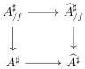

CHAPTER 6. THE \((\infty, \omega)\)-CATEGORY OF SMALL \((\infty, \omega)\)-CATEGORIES

where \( h \) is the left cartesian fibration \( S(A) \to A^t \times A \) corresponding to \( \mathrm{hom}_A: A^t \times A \to \underline{\omega} \). We then have

\[
\operatorname{laxlim} _ {a \rightarrow b: S (A)} \hom_ {B} (f (a), g (a)) \sim \hom_ {\underline {{\omega}}} (1, \operatorname{laxlim} _ {a \rightarrow b: S (A)} h ^ {*} \hom_ {B} (\_, \_)) \tag {6.2.1.18}
\]

\[
\sim \hom_ {\underline {{\mathrm{Hom}}} _ {\square} (S (A), \underline {{\omega}})} (\mathrm{cst} 1, h ^ {*} \hom_ {B} (\_, \_))
\]

\[
\sim \hom_ {\underline {{\mathrm{Hom}}} (A ^ {t} \times A, \underline {{\omega}})} (h _ {!} \mathrm{cst} 1, \hom_ {B} (\_, \_)) \tag {6.2.2.7}
\]

By construction, \( h_{!} \) cst 1 is the Grothendieck deconstruction of the left cartesian fibration \( \mathbf{L}h_{!}id \sim h \), and so is equivalent to \( \mathrm{hom}_A \). We then have

\[
\underset {a \to b: S (A)} {\text { laxlim }} \hom_ {B} (f (a), g (a)) \sim \hom_ {\underline {{\text { Hom }}} (A ^ {t} \times A, \underline {{\omega}})} (\hom_ {A} (\_, \_), \hom_ {B} (f (\_, g (\_))))
\]

We have a canonical equivalence \(\underline{\mathrm{Hom}}(A^t \times A, \underline{\omega}) \sim \underline{\mathrm{Hom}}(A, \widehat{A})\) sending the functor \(\mathrm{hom}_A\) to the Yoneda embedding \(y^A\), and \(\mathrm{hom}_B(f(\_), g(\_))\) is \(f^*(y^B \circ g)\). We then have

\[
\hom (\hom_ {A} (\_, \_), \hom_ {B} (f (\_, g (\_))) \sim \hom_ {\underline {{\mathrm{Hom}}} (A, \widehat {A})} (y ^ {A}, f ^ {*} (y ^ {B} \circ g))
\]

\[
\sim \hom_ {\underline {{\mathrm{Hom}}} (A, \widehat {B})} (f _ {!} \circ y ^ {A}, y ^ {B} \circ g) \tag {6.2.2.7}
\]

\[
\sim \hom_ {\underline {{\mathrm{Hom}}} (A, \widehat {B})} (y ^ {B} \circ f, y ^ {B} \circ g) \tag {6.2.3.3}
\]

\[
\sim \hom_ {\underline {{\mathrm{Hom}}} (A, B)} (f, g) \quad (\text { Yoneda   lemma })
\]

□

6.2.3.23. We suppose the existence of a Grothendieck universe \(\mathbf{Z}\) containing \(\mathbf{W}\). As a consequence, we can use all the results of the last three subsections to respectively \(\mathbf{V}\)-small and locally \(\mathbf{V}\)-small objects.

Let \( A \) be a U-small \( (\infty, \omega) \)-category. Let \( f \) be an object of \( \widehat{A} \). We define \( A_{/f}^{\sharp} \) as the following pullback

Theorem 6.2.3.24. The colimit of the functor \(\pi : A_{/f}^{\sharp} \to A^{\sharp} \to \widehat{A}^{\sharp}\) is \(f\).

Proof. We denote by \(\pi'\) the canonical projection \(\widehat{A}_{/f}^{\sharp} \to \widehat{A}^{\sharp}\), and \(t_{A_{/f}^{\sharp}}: A_{/f}^{\sharp} \to 1\), \(t_{\widehat{A}_{/f}^{\sharp}}: \widehat{A}_{/f}^{\sharp} \to 1\) the canonical morphisms. By the explicit construction of colimits in \((\infty, \omega)\)-presheaves, we have equivalences

\[
\int_ {A ^ {t}} \underset {A _ {/ f} ^ {\sharp}} {\operatorname{colim}} \pi \sim (i d _ {(A ^ {t}) ^ {\sharp}} \times t _ {A _ {/ f} ^ {\sharp}})! E \qquad \int_ {A ^ {t}} \underset {\widehat {A} _ {/ f} ^ {\sharp}} {\operatorname{colim}} \pi^ {\prime} \sim (i d _ {(A ^ {t}) ^ {\sharp}} \times t _ {\widehat {A} _ {/ f} ^ {\sharp}})! F
\]

where \(E\) is the object of \(\mathrm{LCart}(A^{\sharp} \times A_{/f}^{\sharp})\) induced by currying \(\pi\), and \(F\) is the object of \(\mathrm{LCart}(A^{\sharp} \times \widehat{A}_{/f}^{\sharp})\) induced by currying \(\pi'\). We denote by \(X \to A^{\sharp} \times A_{/f}^{\sharp}\) the left cartesian

358