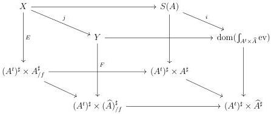

6.2. YONEDA LEMMA AND APPLICATIONS

fibration corresponding to $E$, and by $Y \to (A^t)^\sharp \times \widehat{A}_{/f}^\sharp$ the left fibration corresponding to $F$. All this data fits in the diagram

where all squares are cartesian. Furthermore, according to the Yoneda lemma, $\mathrm{dom}(\int_{A^t \times \widehat{A}} \mathrm{ev}))$ is equivalent to $\mathrm{dom}(\int_{A^t \times \widehat{A}} \mathrm{hom}_{\widehat{A}}(y_{-}, -))$, and lemma 6.2.1.17 implies that $i$ is initial. As the lower horizontal morphism is a right cartesian fibration, and the dual version of proposition 5.2.4.7 induces that $j$ is initial. This implies that the canonical morphism

$$(id_{(A^t)^\sharp} \times \bot_{A_{/f}^\sharp})_! E \to (id_{(A^t)^\sharp} \times \bot_{\widehat{A}_{/f}^\sharp})_! F$$

is an equivalence, and we then have

$$\underset{A_{/f}^\sharp}{\mathrm{colim}} \pi \sim \underset{\widehat{A}_{/f}^\sharp}{\mathrm{colim}} \pi'$$

However, $A_{/f}^\sharp$ admits a terminal element, given by $id_f$, and according to proposition 6.2.3.17, we have

$$\underset{A_{/f}^\sharp}{\mathrm{colim}} \pi \sim f.$$

**Corollary 6.2.3.25.** *A U-small $(\infty, \omega)$-category $A$ is lax U-cocomplete if and only if the Yoneda embedding has a left adjoint, which we will also note by laxcolim.*

*Proof.* If such a left adjoint exists, as $\widehat{A}$ is lax U-cocomplete, corollary 6.2.3.18 implies that $A$ is lax U-cocomplete. Suppose now that $A$ is lax U-cocomplete and let $f: A^t \to \underline{\omega}$ be a functor. Let $c$ be the colimit of the functor $A_{/f}^\sharp \to A^\sharp$. According to theorem 6.2.3.24, we have a sequence of equivalences

$$\begin{array}{l} \mathrm{hom}_{\widehat{A}}(f, y(a)) \sim \mathrm{hom}_{\widehat{A}}(\mathrm{laxcolim}_{A_{/f}^\sharp} y(\_), y(a)) \\ \quad \sim \mathrm{laxlim}_{A_{/f}^\sharp} \mathrm{hom}_{\widehat{A}}(y(\_), y(a)) \\ \quad \sim \mathrm{laxlim}_{A_{/f}^\sharp} \mathrm{hom}_A(\_, a) \\ \quad \sim \mathrm{hom}_A \mathrm{hom}(c, a) \end{array}$$

359