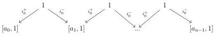
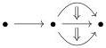

1.1. BASIC CONSTRUCTIONS

that sends a sequence \((C_n, \tau_n C_{n+1} \cong C_n)\) to the colimit of the induced sequence:

\[
i _ {0} C _ {0} \rightarrow i _ {1} C _ {1} \rightarrow \dots \rightarrow i _ {n} C _ {n} \rightarrow \dots
\]

We then have an equivalence

\[
(0, \omega) \text {-cat} \cong \lim _ {n: \mathbb {N}} (0, n) \text {-cat}.
\]

#### 1.1.2 The category \(\Theta\)

1.1.2.1. Let n be a non negative integer and  \( a := \{a_{0}, a_{1}, ..., a_{n-1}\} \)  a sequence of  \( (0, \omega) \) -categories. We denote  \( [a, n] \)  the colimit of the following diagram:

1.1.2.2. We define  \( \Theta \)  as the smallest full subcategory of  \( (0,\omega) \) -cat that includes the terminal  \( (0,\omega) \) -category [0], and such that for any non negative integer n, and any finite sequence  \( a := \{a_{0}, a_{1}, ..., a_{n-1}\} \)  of objects of  \( \Theta \) , it includes the  \( (0,\omega) \) -category  \( [a, n] \) . Objects of  \( \Theta \)  are called globular sum.

Remark that a morphism \( g:[\mathbf{a},n]\to [\mathbf{b},m] \) is exactly the data of a morphism \( f:[n]\to [m] \), and for any integer \( i \), a morphism

\[
a _ {i} \rightarrow \prod_ {f (i) \leq k <   f (i + 1)} b _ {k}.
\]

Example 1.1.2.3. For any n,  \( D_{n} \)  is a globular sum. The  \( (0,\omega) \) -category induced by the  \( \omega \) -graph

is a globular sum.

1.1.2.4. For a globular sum \(a\) and an integer \(n\), we define \([a, n] := [\{a, a, ..., a\}, n]\). For a sequence of integer \(\{n_0, .., n_k\}\) and a sequence of globular sum \(\{a_0, .., a_k\}\), we define \([a_0, n_0] \vee [a_1, n_1] \vee ... \vee [a_k, n_k]\) as the globular sum \([\{a_0, .., a_1, ..., a_k, ...\}, n_0 + n_1 + ... + n_k]\).

We denote by [0] the terminal \((\infty, \omega)\)-category, and \([n]\) the globular sum \([[0], n]\). We have a fully faithful functor \(\Delta \to \Theta\) sending \([n]\) onto \([n]\).

29