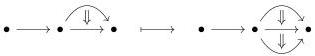
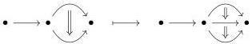

1.1. BASIC CONSTRUCTIONS

1.1.2.9. We recall that a morphism $g : [\mathbf{a}, n] \to [\mathbf{b}, m]$ is exactly the data of a morphism $f : [n] \to [m]$, and for any integer $i$, a morphism

$$a_i \to \prod_{f(i) \le k < f(i+1)} b_k.$$

The morphism $g$ is *globular* if for any $k < n$, $f(k+1) = f(k) + 1$ and the morphism $a_k \to b_k$ is globular. The morphism $g$ is *algebraic* if it cannot be written as a composite $ig'$ where $i$ is a globular morphism.

**Example 1.1.2.10.** The morphism

is globular. This is not the case for the morphism

that sends the 2-cell of the left globular sum on the 1-composite of the two 2-cells of the right globular sum.

**Proposition 1.1.2.11** ([Ara10, Proposition 3.3.10]). *Every morphism in $\Theta$ can be factored uniquely in an algebraic morphism followed by a globular morphism.*

1.1.2.12. We define for any globular sum $a$ and any integer $n$ a globular sum $s_n(a) :=: t_n(a)$ and two morphisms

$$s_n(a) \to a \leftarrow t_n(a).$$

We first set $s_0(a) :=: t_0(a) := [0]$. The inclusion $s_0(a) \to a$ corresponds to the initial point and $t_0(a) \to a$ to the terminal point. For $n > 0$, we define $s_n([\mathbf{a}, n]) :=: t_n([\mathbf{a}, n]) := [s_{n-1}(\mathbf{a}), n]$ where $s_{n-1}(\mathbf{a})$ is the sequence $\{s_{n-1}(a_i)\}_{i<n}$.

31