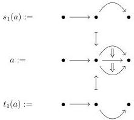
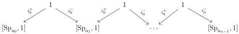
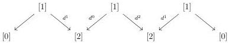

CHAPTER 1. THE CATEGORY OF \((0,\omega)\)-CATEGORIES

Example 1.1.2.13. If a is the globular sum of example 1.1.2.3, we have:

1.1.2.14. The morphism  \( [\_, 1] : \Theta \to \Theta \)  induces by extension by colimit a functor

\[
[ \_, 1 ]: \mathrm{Psh} (\Theta) \to \mathrm{Psh} (\Theta).
\]

We define by induction on \(a\) a \(\Theta\)-presheaf \(\mathrm{Sp}_a\) and a morphism \(\mathrm{Sp}_a \to a\). If \(a\) is [0], we set \(\mathrm{Sp}_{[0]} := [0]\). For \(n > 0\), we define \(\mathrm{Sp}_{[\mathbf{a}, n]}\) as the set valued presheaf on \(\Theta\) obtained as the colimit of the diagram

We define  \( E^{eq} \)  as the set valued preheaves on  \( \Delta \)  obtained as the colimit of the diagram

For any integer n, the morphism  \( \Sigma^{n}:\Theta\to\Theta \) , which is the n-iteration of  \( [\_,1] \) , induces by colimit a functor

\[
\Sigma^ {n}: \mathrm{Psh} (\Theta) \to \mathrm{Psh} (\Theta).
\]

We define two sets of morphisms of  \( \mathrm{Psh}(\Theta) \) :

\[
\mathrm{W} _ {\text {Seg}} := \left\{\mathrm{Sp} _ {a} \rightarrow a, a \in \Theta \right\} \quad \mathrm{W} _ {\text {Sat}} := \left\{\Sigma^ {n} E ^ {e q} \rightarrow \mathbf {D} _ {n} \right\}
\]

and we set

\[
\mathrm{W} := \mathrm{W} _ {\mathrm{Seg}} \cup \mathrm{W} _ {\mathrm{Sat}}.
\]

For any \(n\), we also define

\[
\mathrm{W} _ {n} := \mathrm{W} \cap \Theta_ {n}.
\]

32