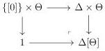
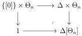

1.1. BASIC CONSTRUCTIONS

1.1.2.15. We recall that for an integer $n$ and a globular sum $a$, we defined $[a, n] := [\{a, a, \dots, a\}, n]$. This defines a functor $i : \Delta[\Theta] \to \Theta$ sending $(n, a)$ on $[a, n]$ where $\Delta[\Theta]$ is the following pushout of category:

For the sake of simplicity, we will also denote by $[a, n]$ (resp. $[n]$) the object of $\Delta[\Theta]$ corresponding to $(n, a)$ (resp. to $(n, [0])$). We define two sets of morphisms:

$$\mathrm{M}_{\mathrm{Seg}} := \{[a, \mathrm{Sp}_n] \to [a, n], \ a : \Theta\} \cup \{[f, 1], \ f \in \mathrm{W}_{\mathrm{Seg}}\}$$

$$\mathrm{M}_{\mathrm{Sat}} := \{E^{eq} \to [0]\} \cup \{[f, 1], \ f \in \mathrm{W}_{\mathrm{Sat}}\}$$

and we set

$$\mathrm{M} := \mathrm{M}_{\mathrm{Seg}} \cup \mathrm{M}_{\mathrm{Sat}}.$$

For an integer $n$, we define $\Delta[\Theta_n]$ as the following pushout of category:

and the functor $i$ induces a functor $\Delta[\Theta_n] \to \Theta_{n+1}$. For any $n$, we define

$$\mathrm{M}_n := \mathrm{M} \cap \Delta[\Theta_n].$$

1.1.2.16. Let $C$ be a presentable category and $S$ a set of monomorphisms with small codomains. An object $x$ is $S$-local if for any $i : a \to b \in S$, the induced functor $\mathrm{Hom}(i, x) : \mathrm{Hom}(b, x) \to \mathrm{Hom}(a, x)$ is an isomorphism. We define $C_S$ as the full subcategory of $C$ composed of $S$-local objects. According to theorem 4.1.3.3, the inclusion $\iota : C_S \to C$ is part of an adjunction

$$\mathbf{F}_S : C \xrightarrow[\longleftarrow]{} C_S : \iota$$

Moreover, the theorem op cit also states that $\mathbf{F}_S : C \to C_S$ is the localization of $C$ by the smallest class of morphisms containing $S$ and stable under composition and colimit.

Suppose given an other category $D$ fitting in an adjunction

$$F : C \xrightarrow[\longleftarrow]{} D : G$$

33