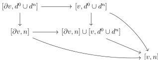

CHAPTER 1. THE CATEGORY OF (0, ω)-CATEGORIES

**Lemma 1.1.3.7.** *For any globular sum v, and any integer n, the morphism [v, d⁰ ∪ dⁿ] ∪ [∂v, n] → [v, n] appearing in the diagram*

is in M̅.

*Proof.* Let a be a globular sum. Remark that the morphism [a, Spₙ] → [a, d⁰ ∪ dⁿ] is in M̅. By left cancellation, this implies that [a, d⁰ ∪ dⁿ] → [a, n] is in M̅. For any presheaf X on Θ, Θ/X is an elegant Reedy category, and [X, d⁰ ∪ dⁿ] → [X, n] is then in M̅. In particular, [∂v, d⁰ ∪ dⁿ] → [∂v, n] is in M̅, and so is [v, d⁰ ∪ dⁿ] → [∂v, n] ∪ [v, d⁰ ∪ dⁿ] by stability by coproduct. A last use of the stability by left cancellation then concludes the proof. □

**1.1.3.8.** Let [b, m] be an element of Δ[Θ]. We denote Hom*(i([b, m]), [a, n]) the subset of Hom(i([b, m]), [a, n]) that consists of morphisms that preserve extremal objects. The explicit expression of morphism in Θ implies the bijection:

$$\mathrm{Hom}_{\Theta}^{*}(i([b, m]), [a, n]) \cong \mathrm{Hom}_{\Delta}([n], [m])^{*} \times \prod_{i<n} \mathrm{Hom}_{\Theta}(b, a_{i}) \quad (1.1.3.9)$$

where Hom*Δ([n], [m]) is the subset of HomΔ([n], [m]) consisting of morphisms that preserve extremal objects.

Let a := {a₀, a₁, ..., aₙ₋₁} be a finite sequence of globular sums. We define Θ→/a as the category whose objects are collections of maps {b → aᵢ}ᵢ<ₙ such that there exists no degenerate morphism b → b' factorizing all b → aᵢ. Morphisms are monomorphisms b → b' making all induced triangles commute.

The bijection (1.1.3.9) induces a bijection between the objects of Θ→/a and the morphisms [b, n] → i*[a, n] that are the identity on objects and that can not be factored through any degenerate morphism [b, n] → [b̅, n].

**Lemma 1.1.3.10.** *For any morphism p : [b, m] → i*[a, n] in Psh(Δ[Θ]) that preserves extremal objects, there exists a unique pair ({b' → aᵢ}ᵢ<ₙ, [f, i] : [b, m] → [b', n]) where {b' → aᵢ}ᵢ<ₙ is an element of Θ→/a, f is a degenerate morphism, and such that the induced*

36