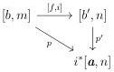
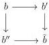
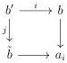

1.1. BASIC CONSTRUCTIONS

triangle

commutes.

Proof. By adjunction and thanks to the bijection (1.1.3.9), p corresponds to a pair  \( (j : [m] \to [n], \{b \to a_i\}_{i < n}) \) , and i has to be equal to j.

Using once again this bijection, and the fact that degeneracies are epimorphisms, we have to show that there exists a unique degenerate morphism  \( g : b \to b' \)  that factors the morphisms  \( b \to a_i \)  for all i < n, and such that the induced family of morphisms  \( \{b' \to a_i\}_{i < n} \)  is an element of  \( \Theta_{/a}^{\rightarrow} \) .

As any infinite sequence of degenerate morphisms is constant at some point, the existence is immediate.

Suppose given two morphisms  \( b \rightarrow b' \) ,  \( b \rightarrow b'' \)  fulfilling the previous condition. The proposition 3.8 of [BR13b] implies that there exists a globular sum  \( \tilde{b} \)  and two degenerate morphisms  \( b' \rightarrow \tilde{b} \)  and  \( b'' \rightarrow \tilde{b} \)  such that the induced square

is cartesian. The universal property of pushout implies that  \( b \rightarrow \tilde{b} \)  also fulfills the previous condition. By definition of  \( b' \)  and  \( b'' \) , this implies that they are equal to  \( \tilde{b} \) , and this shows the uniqueness.

Lemma 1.1.3.11. Let \(\{b\to a_i\}_{i < n}\) be an element of \(\Theta_{/a}^{\rightarrow}\) and \(i:b'\to b\) a monomorphism of \(\Theta\). The induced family \(\{b'\to b\to a_i\}_{i < n}\) is an object of \(\Theta_{/a}^{\rightarrow}\).

Proof. The lemma 1.1.3.10 implies that there exists a unique degenerate morphism \( j: b' \to \tilde{b} \) that factors all the morphism \( b' \to b \to a_i \) for \( i < n \), and such the induced family of morphisms \( \{\tilde{b} \to a_i\}_{i < n} \) is an element of \( \Theta_{/a}^{\rightarrow} \). We proceed by contradiction, and we then suppose that \( j \) is different from the identity.

We then have, for any i < n, a commutative square

37