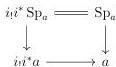

CHAPTER 1. THE CATEGORY OF $(0, \omega)$-CATEGORIES

**Proposition 1.1.3.17.** *There is an inclusion $i^* \mathbb{W} \subset \overline{\mathbb{M}}$.*

*Proof.* For Segal extensions, this is precisely the content of the last lemma. For saturation extensions, remark that $i^* \mathbb{W}_{\text{Sat}} = \mathbb{M}_{\text{Sat}}$. $\square$

*Proof of theorem 1.1.3.3.* Let $a$ be a globe. We then have $i_! i^* a = a$. Suppose now that $a$ is any globular sum. We then have a commutative diagram

where the upper horizontal morphism is an identity. The proposition 1.1.3.17 and the fact that $i_!(\mathbb{M}) \subset \mathbb{W}$ implies that the vertical morphisms of the previous diagram are in $\overline{\mathbb{W}}$. By left cancellation, this implies that $i_! i^* a \to a$ belongs to $\overline{\mathbb{W}}$ for any globular sum. We proceed analogously to show that for any $b \in \Delta[\Theta]$, $b \to i^* i_! b$ is in $\overline{\mathbb{M}}$. $\square$

## 1.2 Gray Operations

### 1.2.1 Recollection on Steiner theory

We present here the Steiner theory developed in [Ste04].

**1.2.1.1.** An augmented directed complex $(K, K^*, e)$ is given by a complex of abelian groups $K$, with an augmentation $e$:

$$\mathbb{Z} \xleftarrow{e} K_0 \xleftarrow{\partial_0} K_1 \xleftarrow{\partial_1} K_2 \xleftarrow{\partial_2} K_3 \xleftarrow{\partial_3} \dots$$

and a graded set $K^* = (K_n^*)_{n \in \mathbb{N}}$ such that for any $n$, $K_n^*$ is a submonoid of $K_n$. A morphism of directed complexes between $(K, K^*, e)$ and $(L, L^*, e')$ is given by a morphism of augmented complexes of abelian groups $f : (K, e) \to (L, e')$ such that $f(K_n^*) \subset L_n^*$ for any $n$. We note by ADC the category of augmented directed complexes.

Steiner then constructs an adjunction

$$\lambda : \omega\text{-cat} \xrightarrow{\perp} \text{ADC} : \nu$$

The functor $\lambda$ is the simplest to define:

**Definition 1.2.1.2.** Let $C$ be a $\omega$-category. We denote by $(\lambda C)_n$ the abelian group generated by the set $\{[x]_n : x \in C_n\}$ and the relations

$$[x *_m y]_n \sim [x]_n + [y]_n \text{ for } m < n.$$

40