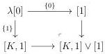
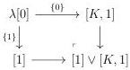

1.2. GRAY OPERATIONS

- \([K,1]\) is the chain complex whose value on \(n\) is:

\[
[ K, 1 ] := \left\{ \begin{array}{l l} \mathbb {Z} [ \{0 \}, \{1 \} ] & \text {if n = 0} \\ \{[ x, 1 ], x \in K _ {n - 1} \} & \text {if n > 0} \end{array} \right.
\]

and the differential is the unique graded group morphism fulfilling:

\[
\partial ([ x, 1 ]) := \left\{ \begin{array}{l l} \{1 \} - \{0 \} & \text {if} | x | = 0 \\ [ \partial x, 1 ] & \text {if} | x | > 0 \end{array} \right.
\]

- \(([K,1])^{*}\) is given on all integer \(n\) by:

\[
([ K, 1 ]) _ {n} ^ {*} := \left\{ \begin{array}{l l} \mathbb {N} [ 0, 1 ] & \text {if n = 0} \\ \{[ x, 1 ], x \in K _ {n - 1} ^ {*} \} & \text {if n > 0} \end{array} \right.
\]

- \(e: ([K, 1])_0 \to \mathbb{Z}\) is the unique morphism fulfilling

\[
e (0) = e (1) = e (x).
\]

Proposition 1.2.2.12. Let A be a non null augmented directed complex admitting no non-trivial automorphisms. Then the augmented directed complex  \( [A,1] \)  has no non-trivial automorphisms.

Proof. Let \(\phi : [A,1] \to [A,1]\) be an automorphism. As the element \(\{1\} \in ([A,1])_0\) is the only element of the basis such that for all \(v \in [A,1]_1 \partial_0^- (v) \neq \{1\}\), it is preserved by \(\phi\). As a consequence, \(\phi\) also preserves \(\{0\}\). The induced morphism \(\phi_0 : [A,1]_0 \to [A,1]_0\) is then the identity.

Now, remark that  \( (\phi_{n+1})_{n\in\mathbb{N}}: A \to A \)  is an automorphism and is then the identity. This implies that for all n > 0,  \( \phi_{n}: [A,1]_{n} \to [A,1]_{n} \)  is then identity, which concludes the proof. □

1.2.2.13. We define the wedges as the functors

\[
[ \_, 1 ] \vee [ 1 ]: \mathrm{ADC} \rightarrow \mathrm{ADC} \quad [ 1 ] \vee [ \_, 1 ]: \mathrm{ADC} \rightarrow \mathrm{ADC}
\]

where  \( [K,1]\vee[1] \)  and  \( [1]\vee[K,1] \)  are defined as the following pushouts:

Once again, we can easily check that  \( [K,1]\vee[1] \)  and  \( [1]\vee[K,1] \)  have a loop free and unitary basis when this is the case for K. These functors then induce functors

\[
[ \_, 1 ] \vee [ 1 ]: \mathrm{ADC} _ {\mathrm{B}} \rightarrow \mathrm{ADC} _ {\mathrm{B}} \quad [ 1 ] \vee [ \_, 1 ]: \mathrm{ADC} _ {\mathrm{B}} \rightarrow \mathrm{ADC} _ {\mathrm{B}}
\]

51