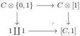
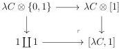

CHAPTER 1. THE CATEGORY OF \((0,\omega)\)-CATEGORIES

1.2.3.2. The monoidal product on  \( (0,\omega) \) -cat induced by the previous theorem is called the Gray tensor product and is denoted by  \( \otimes \) . It's unit is  \( D_{0} \) . If C and D are  \( (0,\omega) \) -categories with an atomic and loop free basis, we have by construction

\[
C \otimes D := \nu (\lambda C \otimes \lambda D).
\]

The induced functor

\[
\_ \otimes [ 1 ]: (0, \omega) \text {-cat} \to (0, \omega) \text {-cat}
\]

is called the Gray cylinder.

Proposition 1.2.3.3. Let \(C\) be an \((\infty, \omega)\)-category. The following canonical square

is cocartesian

Proof. As all these functors commute with colimits, it is sufficient to demonstrate this assertion when C is a globular sum, and a fortiori when C admits a loop free and atomic basis. In this case, remark that all the morphisms appearing in canonical cartesian square

are quasi-rigid. The results then follow from an application of theorem 1.2.1.26.

1.2.3.4. Applying the duality  \( (\_)^{op} \)  to the computation achieved in appendix B.1 of [AM20], we can give an explicit expression of  \( D_{n} \otimes [1] \) . As a polygraph, the generating arrows of  \( D_{n} \otimes [1] \)  are:

\[
e _ {k} ^ {\epsilon} \otimes \{0 \} \qquad e _ {k} ^ {\epsilon} \otimes \{1 \} \qquad e _ {k} ^ {\epsilon} \otimes [ 1 ]
\]

\[
a _ {0} ^ {-} \otimes e _ {k} ^ {\epsilon} \qquad a _ {0} ^ {+} \otimes e _ {k} ^ {\epsilon} \qquad a \otimes e _ {k} ^ {\epsilon}
\]

where \(\epsilon\) is either \(+\) or \(-\), \(k \leqslant n\) and \(e_n^+ = e_n^-\). Their source and target are given as follows:

\[
\pi^ {-} (e _ {k} ^ {\epsilon} \otimes \{0 \}) = e _ {k - 1} ^ {-} \otimes \{0 \} \qquad \qquad \pi^ {+} (e _ {k} ^ {\epsilon} \otimes \{0 \}) = e _ {k - 1} ^ {+} \otimes \{0 \}
\]

\[
\pi^ {-} (e _ {k} ^ {\epsilon} \otimes \{1 \}) = e _ {k - 1} ^ {-} \otimes \{1 \} \qquad \qquad \pi^ {+} (e _ {k} ^ {\epsilon} \otimes \{1 \}) = e _ {k - 1} ^ {+} \otimes \{1 \}
\]

\[
\pi^ {-} (e _ {2 k} ^ {\epsilon} \otimes [ 1 ]) = \ldots \circ_ {2} (e _ {0} ^ {+} \otimes [ 1 ]) \circ_ {0} (e _ {2 k} ^ {\epsilon} \otimes \{0 \}) \circ_ {1} (e _ {1} ^ {-} \otimes [ 1 ]) \circ_ {3} \ldots \circ_ {2 k - 1} (e _ {2 k - 1} ^ {-} \otimes [ 1 ])
\]

54