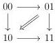
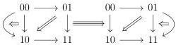
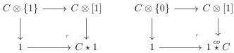
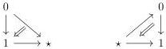
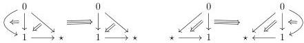

1.2. GRAY OPERATIONS

\[
\pi^ {+} (e _ {2 k} ^ {\epsilon} \otimes [ 1 ]) = (e _ {2 k - 1} ^ {+} \otimes [ 1 ]) \circ_ {2 k - 1} \dots \circ_ {3} (e _ {1} ^ {+} \otimes [ 1 ]) \circ_ {1} (e _ {2 k} ^ {\epsilon} \otimes \{1 \}) \circ_ {0} (e _ {0} ^ {-} \otimes [ 1 ]) \circ_ {2} \dots
\]

\[
\pi^ {-} (e _ {2 k + 1} ^ {\epsilon} \otimes [ 1 ]) = \ldots \circ_ {3} (e _ {1} ^ {+} \otimes [ 1 ]) \circ_ {1} (e _ {2 k + 1} ^ {\epsilon} \otimes \{1 \}) \circ_ {0} (e _ {0} ^ {-} \otimes [ 1 ]) \circ_ {2} \ldots \circ_ {2 k} (e _ {2 k} ^ {-} \otimes [ 1 ])
\]

\[
\pi^ {+} (e _ {2 k + 1} ^ {\epsilon} \otimes [ 1 ]) = (e _ {2 k} ^ {+} \otimes [ 1 ]) \circ_ {2 k} \dots \circ_ {2} (e _ {0} ^ {+} \otimes [ 1 ]) \circ_ {0} (e _ {2 k + 1} ^ {\epsilon} \otimes \{0 \}) \circ_ {1} (e _ {1} ^ {-} \otimes [ 1 ]) \circ_ {3} \dots
\]

We did not put parenthesis in the expression above, to keep them shorter, the default convention is to do the composition \(\circ_{i}\) in order of increasing values of \(i\).

Example 1.2.3.5. The \((0,\omega)\)-category \(\mathbf{D}_1\otimes [1]\) is the polygraph:

The \((0,\omega)\)-category \(\mathbf{D}_2\otimes [1]\) is the polygraph:

1.2.3.6. We define the Gray cone and the Gray o-cone:

\[
\begin{array}{c c c c c c} (0, \omega) \text {-cat} & \to & (0, \omega) \text {-cat.} & (0, \omega) \text {-cat} & \to & (0, \omega) \text {-cat.} \\ C & \mapsto & C \star 1 & C & \mapsto & 1 \stackrel {{c o}} {{\star}} C \end{array}
\]

where \(C\star 1\) and \(1\stackrel {co}{\star}C\) are defined as the following pushout:

Example 1.2.3.7. The \((0,\omega)\)-categories \(\mathbf{D}_1\star 1\) and \(1\stackrel {co}{\star}\mathbf{D}_1\) correspond respectively to the polygraphs:

The \((0,\omega)\)-categories \(\mathbf{D}_2\star 1\) and \(1\stackrel {co}{\star}\mathbf{D}_2\) correspond respectively to the polygraphs:

55