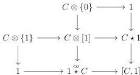
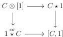
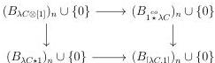
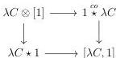
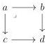
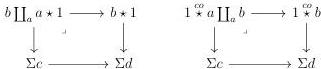

CHAPTER 1. THE CATEGORY OF (0, ω)-CATEGORIES

cocartesian:

Proof. The five squares are cocartesian by construction. Since the proofs of the cartesianess of all squares are identical, we will only show the proof for the square

To this extend, remark that for any integer n, the following square is cartesian.

This then implies that the following square in the category ADC is cartesian.

As ν is a right adjoint, it preserves limits, and as it commutes with Gray operation, this concludes the proof.

Lemma 1.2.3.16. Let a, b, c and d be four globular sums. Suppose given a cartesian square:

where the two horizontal morphisms are globular. The two following squares are cartesian

58