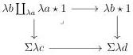
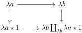

1.2. GRAY OPERATIONS

Proof. We show only the cartesianess of the first square, as the cartesianess of the second one follows by applying the duality $(\_)^\circ$. A direct computation shows that for any integer $n$, the following square is cartesian

To conclude, one has to show that the canonical morphism

$$\nu(\lambda b) \coprod_{\nu(\lambda a)} \nu(\lambda a \star 1) \to \nu(\lambda b \coprod_{\lambda a} \lambda a \star 1)$$

is an equivalence. As $a \to b$ is globular, all the morphisms of the following cocartesian square are quasi-rigid.

The results then follow from an application of theorem 1.2.1.26.

1.2.3.17. The end of this section is devoted to proving the following theorem:

Theorem 1.2.3.18. Let $F$ be an endofunctor of $(0, \omega)$-cat such that the induced functor $(0, \omega)$-cat $\to (0, \omega)$-cat$_{F(\emptyset)/}$ is colimit preserving and $\psi$ an invertible natural transformation between $G \cup \{\emptyset\} \to (0, \omega)$-cat $\xrightarrow{F} (0, \omega)$-cat and $G \cup \{\emptyset\} \to (0, \omega)$-cat $\xrightarrow{G} (0, \omega)$-cat where $G$ is either the Gray cylinder, the Gray cone, the Gray $\circ$-cone or an iterated suspension.

Then, the natural transformation $\psi$ can be extended to an invertible natural transformation between $F$ and $G$.

The previous theorem implies that the equations given in theorem 1.2.3.13 and 1.2.3.14 characterize respectively the Gray cylinder, the Gray cone, and the Gray $\circ$-cone. We also have the following corollary:

Corollary 1.2.3.19. The colimit preserving endofunctor $F : (0, \omega)$-cat $\to (0, \omega)$-cat, sending $[a, n]$ to the colimit of the span

$$\coprod_{k \le n} \{k\} \leftarrow \coprod_{k \le n} a \otimes \{k\} \to a \otimes [n]$$

is equivalent to the identity.

59