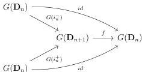

CHAPTER 1. THE CATEGORY OF (0, ω)-CATEGORIES

Proof. The theorem 1.2.3.13 implies that the restriction of F to globes is equivalent to the restriction of the identity to globes. As the identity is the 0-iterated suspension, we can apply theorem 1.2.3.18. □

Lemma 1.2.3.20. A sub category Θ' of Θ, stable by colimit and containing globular morphisms is equal to Θ iff

(1) for any integer n, i_n^- : D_n → D_{n+1} belongs to Θ'.
(2) For any integer n, the unit I_n : D_{n+1} → D_n belongs to Θ'.
(3) For any pair of integers k < n, the composition ∇_{k,n} : D_n → D_n ∐_k D_n belongs to Θ'.

Proof. Suppose that Θ' fulfills these conditions. As globular morphisms are compositions of pushouts along morphisms of shape i_n^-, they belong to Θ'. As algebraic morphisms are compositions of colimits of morphism of shape ∇_{k,n} or I_n, they belong to Θ'. The result then follows from [Ara10, proposition 3.3.10] that states that every morphism factors as an algebraic morphism followed by a globular morphism. □

Lemma 1.2.3.21. Let n be an integer, and G be either the Gray cylinder, the Gray cone, the Gray o-cone or an iterated suspension, and suppose given a square

Then, the morphism f is G(I_n).

Proof. As the proof for any possibilities of G are similar, we will show only the case G := _ ⊗ [1]. As for any integer n, D_n ⊗ [1] admits a loop free and atomic basis, we can then show the desired assertion after applying the functor λ. Remark first that the assumption implies that ∂f((e_{n+1} ⊗ {α}) = 0, and so f((e_{n+1} ⊗ {α}) = 0. We also have f(e_{n+1} ⊗ [1]) = 0 as (λ(D_n ⊗ [1])_{n+2} = 0. This implies that f is equal to λ(G(I_n)). □

Lemma 1.2.3.22. Let k < n be two integers, and G be either the Gray cylinder, the Gray

60