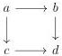
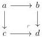
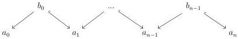

2.1. PRELIMINARIES

Proposition 15.10 of [BSP21] provides a similar result for models of  \( (\infty, n) \) -categories.

### 2.1 Preliminaries

#### 2.1.1 Generalities on model categories

For this chapter, we fix a model category C whose cofibrations are monomorphisms.

2.1.1.1. We give first some results on homotopy colimits. These results will be used freely throughout these first two chapters.

Proposition 2.1.1.2. Suppose given a square

such that the two horizontal morphisms are weak equivalences. Then this square is homotopy cocartesian.

Proof. This is [Cis19, proposition 2.3.26].

Proposition 2.1.1.3. Suppose given a cocartesian square

where the left vertical morphism is a cofibration. Then this square is homotopy cocartesian.

Proof. This is [Cis19, corollary 2.3.28].

Proposition 2.1.1.4. Let \( F: \alpha \to C \) be a diagram indexed by an ordinal. The transfinite composition \( \operatorname{colim}_{\alpha} F \) is the homotopy colimit of the diagram \( F \).

Proof. This is [Cis19, proposition 2.3.13].

Proposition 2.1.1.5. Suppose given a diagram

where all morphisms labelled by  \( \hookrightarrow \)  are cofibrations. The colimit of this diagram is also the homotopy colimit of this diagram.

67