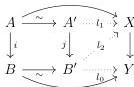

2.1. PRELIMINARIES

**Notation 2.1.1.9.** Let $\_\Box\_: C \times D \rightarrow E$ be a bifunctor. If $f: a \rightarrow b$ and $g: x \rightarrow y$ are respectively morphisms of $C$ and $D$, we will note by $f \triangleq g$ the induced morphism $a\Box y \coprod_{a\Box x} b\Box x \rightarrow b\Box y$.

**Proposition 2.1.1.10** ([Lur09a, proposition A.3.7.3]). *Let $A$ be a nice model structure and $S$ a set of cofibrations. There exists a model structure $A_S$ on the same category, and a left Quillen adjoint $L: A \rightarrow A_S$, such that an object is fibrant in $A_S$ if and only if it is fibrant in $A$ and has the right lifting property against all morphisms of shape $i \hat{\times} f$ where $i$ is a cofibration and $f$ in $S$. Moreover, a left Quillen functor $F: A \rightarrow C$ lifts to $A_S$ if and only if for any cofibration $i$ and morphism $f \in S$, $F(i \hat{\times} f)$ is a weak equivalence.*

**Corollary 2.1.1.11.** *Let $A, C$ be two nice model categories, $F: A \rightarrow C$ a left Quillen functor, $S$ a set of cofibrations and $T$ a set of morphisms such that for any cofibrations $i$ and morphisms $f \in S$, the morphism $i \hat{\times} f$ is included in the smallest saturated class stable by two out of three, containing weak equivalences and $T$. Then a left Quillen functor $F: A \rightarrow C$ lifts to $A$ if and only if it sends morphisms of $T$ to weak equivalences.*

*Proof.* Let $U$ be the class of morphisms in $A$ that are sent to weak equivalences by $F$. This class is obviously stable by two out of three, retracts and contains weak equivalences. As the model structure on $C$ is combinatorial and left proper, it is saturated. The class $U$ then includes all morphisms of shape $i \hat{\times} f$ for $i$ a cofibration and $f \in S$, which implies that $F$ can be lifted to $A_S$. $\Box$

**2.1.1.12.** Let $i: A \rightarrow B$ and $i': A' \rightarrow B'$ be two cofibrations. A *zigzag of acyclic cofibration* between $i$ and $i'$, denoted $i \leftrightarrow i'$ is a zigzag in the category of arrows such that all the horizontal maps are acyclic cofibrations, and all the vertical maps are cofibrations.

**Lemma 2.1.1.13.** *Let $i$ and $j$ be two cofibrations, and $f: X \rightarrow Y$ a fibration between fibrant objects. Suppose that we have a morphism in the category of arrows $i \rightarrow j$ which is pointwise an acyclic cofibration. Then, if $j$ has the left lifting property against $f$, so has $i$.*

*Proof.* We consider a diagram of the following shape:

We construct, one after the other, the lifting $l_0, l_1$ and $l_2$. $\Box$

69