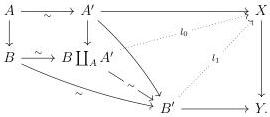

CHAPTER 2. STUDY OF THE COMPLICIAL MODEL

Lemma 2.1.1.14. Let i and j be two cofibrations, and  \( f: X \to Y \)  a fibration between fibrant objects. Suppose that we have a morphism in the category of arrows  \( i \to j \)  which is pointwise an acyclic cofibration. Then, if i has the right lifting property against f, so has j.

Proof. We consider a diagram of the following shape:

We construct, one after the other, the lifting \( l_0 \), \( l_1 \).

Proposition 2.1.1.15. Let f be a fibration between fibrant objects and i and j two cofibrations such that there exists a zigzag of acyclic cofibrations  \( i \leftrightarrow j \) . Then f has the right lifting property against i if and only if it has the right lifting property against j.

Proof. This is a direct consequence of the last two lemmas.

#### 2.1.2 Marked and stratified presheaves

2.1.2.1. Let B be an elegant Reedy category and M a subset of the set of objects of B. A M-stratified presheaf on B, or just a stratified prehsheaf on B when the subset M will be non-ambiguous, is a pair  \( (X, tX) \)  where X is a presheaf on B and  \( tX := \coprod_{a \in M} tX_a \)  is the disjoint union of sets, such that for any  \( a \in M \) ,  \( tX_a \)  is a subset of  \( X_a \)  including degeneracies, i.e the image of morphisms  \( X_p : X_b \to X_a \)  for  \( p : b \to a \)  in  \( B_- \) .

A stratified morphism  \(  f : (X, tX) \to (Y, tY)  \)  is the data of a morphism on the underlying presheaf such that  \(  f(tX_n) \subset tY_n  \) . The category of stratified presheaves is denoted by  \(  \text{tPsh}_M(B)  \) .

A morphism between two stratified presheaves is entire if it is the identity on the underlying presheaves.

We then have an adjunction

\[
(\_) ^ {\flat}: \operatorname{Psh} (B) \xrightarrow [ \leftarrow ]{\perp} \operatorname{tPsh} _ {M} (B): (\_) ^ {\natural}
\]

where the left adjoint is a fully faithful inclusion that sends a presheaf X onto  \( (X, S) \)  where S is the smaller stratification on X, and where the right adjoint is the obvious forgetful functor. We will identify presheaves on B with their image by the functor  \( (\_)^{\flat} \) .

70