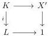
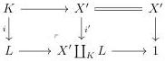

2.2. THE COMPLICIAL MODEL

Proof. Let $\kappa$ be a regular cardinal such that $X$ is $\kappa$-small. Remark first the domain of a entire monomorphism is $\kappa$-small if and only if its codomain is.

Let $I$ be the set of entire acyclic cofibrations with $\kappa$-small codomains and domains. This set generates via the small object argument a weak factorization system, and we denote by $X \to X' \to 1$ the factorization of $X \to 1$. We are willing to show that $X'$ is $M$-marked. As $X \to X'$ is an entire acyclic cofibration by construction, this will directly imply that $X'$ is equal to $\iota(X_{\mathrm{mk}})$ and so demonstrate the desired result.

Suppose then given a diagram

with $i$ an entire acyclic cofibration. We have to show that it admits a lift. Remark that this square factors as:

The morphism $i'$ is an entire acyclic cofibration with $\kappa$-small codomain and domain and then belongs to $i$. The right square of the previous diagram then admits a lift. This induces a lift in the original square, and this concludes the proof.

Proposition 2.1.2.10. Suppose given a nice model structure on $\mathrm{tPsh}_M(B)$. This induces a nice model structure on $\mathrm{mPsh}_M(B)$, making the adjunction (2.1.2.8) a Quillen equivalence. A morphism between two marked presheaves is a cofibration (resp. a fibration) (resp. a weak equivalence) if it is a cofibration (resp. a fibration) (resp. a weak equivalence) when seen as a morphism of $\mathrm{tPsh}_M(B)$.

Proof. Let $f: X \to Y$ be a fibration between stratified presheaves. If $Y$ is marked, so is $X$. The two weak factorization systems on $\mathrm{mPsh}_M(B)$ are then induced by the one of $\mathrm{tPsh}_M(B)$. We leave it to the reader to check that this model structure is nice.

The unit is pointwise a weak equivalence according to proposition 2.1.2.9 and the counit is the identity. The adjunction (2.1.2.8) is then a Quillen equivalence.

## 2.2 The complicial model

### 2.2.1 Model structure on marked simplicial sets

This section is a recollection of the principal results of [OR20b]. We refer to [Rie16] for an introduction to complicial sets.

73