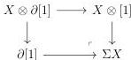
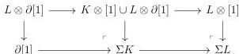
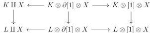

CHAPTER 2. STUDY OF THE COMPLICIAL MODEL

**2.2.2.12.** Let $X$ be a marked simplicial set. We define the *suspension* of $X$, noted by $\Sigma X$, as the following pushout:

This assignation defines a cocontinuous functor $\Sigma : \mathrm{mPsh}(\Delta) \to \mathrm{mPsh}(\Delta)_{\partial[1]}$. For every acyclic cofibration $K \to L$, we have cartesian squares

The suspension then preserves acyclic cofibration and is then a left Quillen functor.

This functor admits a right adjoint, that sends a pair $(a, b, C)$ to $C(a, b)$ where $a, b$ are two 0-simplices of $C$. If $p : C \to D$ is a morphism between complicial sets, and $a, b$ two 0-simplices of $C$, we denote by

$$p(a, b) : C(a, b) \to D(pa, pb)$$

the induced morphism.

**2.2.2.13.** We introduce an other operation, the *diamond product*, that makes the link between the Gray tensor product and the join. Let $X$ and $Y$ be two marked simplicial sets. We define $X \diamond Y$ as the colimit of the diagram:

$$X \longleftarrow X \otimes \{0\} \otimes Y \longrightarrow X \otimes [1] \otimes Y \longleftarrow X \otimes \{1\} \otimes Y \longrightarrow Y$$

The functors

$$\_ \diamond X : \mathrm{mPsh}(\Delta) \to \mathrm{mPsh}(\Delta)_{/X} \quad \text{and} \quad X \diamond \_ : \mathrm{mPsh}(\Delta) \to \mathrm{mPsh}(\Delta)_{/X}$$

are colimit preserving. Furthermore, for every acyclic cofibration $K \to L$, the morphism $K \diamond X \to L \diamond X$ is the horizontal colimit of the diagram:

However, these two horizontal colimits are homotopy colimits, and all the horizontal maps of the previous diagram are weak equivalences. This morphism is then an acyclic cofibration. This shows that $\_ \diamond X$ is a left Quillen functor. We show analogously that $X \diamond \_$ is a left Quillen functor.

80