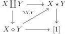

2.2. THE COMPLICIAL MODEL

**Lemma 2.2.2.14.** *There exists a unique natural transformation $\gamma_{X,Y} : X \diamond Y \rightarrow X \star Y$ that fits in the following diagram:*

*Proof.* We begin by defining this morphism on simplicial sets, and for this we can suppose that both $X$ and $Y$ are representables, ie $X := [n]$, $Y := [m]$. On object, this morphism is induced by the assignation:

$$p(k, 0, l) := k \quad p(k, 1, l) := l.$$

We need to verify that this morphism preserves thin cells. Suppose now that $(x, v, y)$ is a thin $n$-simplex of $X \diamond Y$. There are several cases to consider. **Case** $v_n = 0$. The simplex $x$ is then thin, and is sent to $x \star \emptyset$ which is also thin. **Case** $v_0 = 1$. Similar. **Case** $v_0 = 0$ **and** $v_n = 1$. Let $p$ be the smaller integer such that $v_p = 1$. Either $\Pi_{p-1, n-p+1}^1(x)$ or $\Pi_{p, n-p}^2(y)$ is thin. This implies that $\phi_{X,Y}(x, v, y) = \Pi_{p-1, n-p+1}^1(x) \star \Pi_{p, n-p}^2(y)$ is thin. $\square$

**Proposition 2.2.2.15.** *For any $X, Y$, the morphism $\gamma_{X,Y}$ is a weak equivalence.*

*Proof.* The set of couples $(X, Y)$ such that $\gamma_{X,Y}$ is a weak equivalence is saturated by monomorphisms. It is then enough to show the result for any couples of representables.

Let's start by the case $(X, Y) = ([n], [m])$. Let $s : X \star Y \rightarrow X \diamond Y$ be the morphism defined on objects by the formula:

$$s(k \star \emptyset) := (k, 0, 0) \quad s(\emptyset \star l) := (n, 1, l)$$

We have

$$\gamma_{X,Y} s = id \quad s\gamma_{X,Y}(k, \epsilon, l) = (k + \epsilon(n - k), \epsilon, \epsilon l).$$

Let $\eta : [n] \diamond [m] \rightarrow [n] \diamond [m]$ be induced by the application

$$(k, \epsilon, l) \mapsto (k, \epsilon, \epsilon l).$$

We are now going to construct two morphisms

$$\epsilon_0 : ([n] \diamond [m]) \times [1]_t \rightarrow [n] \diamond [m] \quad \text{and} \quad \epsilon_1 : ([n] \diamond [m]) \times [1]_t \rightarrow [n] \diamond [m]$$

such that

$$\begin{aligned} \epsilon_0(\_, 0) &= \eta & \epsilon_0(\_, 1) &= s\gamma_{X,Y} \\ \epsilon_1(\_, 0) &= \eta & \epsilon_1(\_, 1) &= id \end{aligned}$$

81